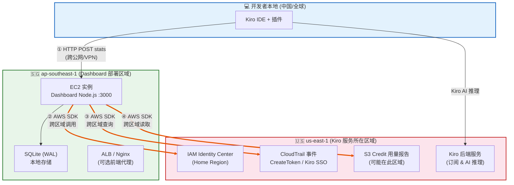
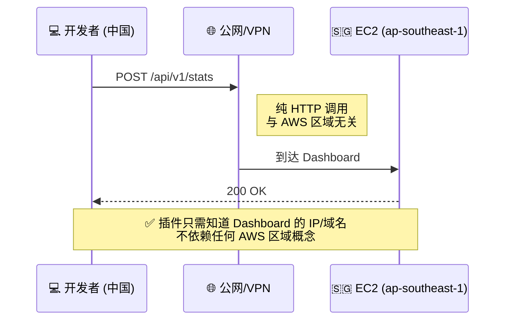
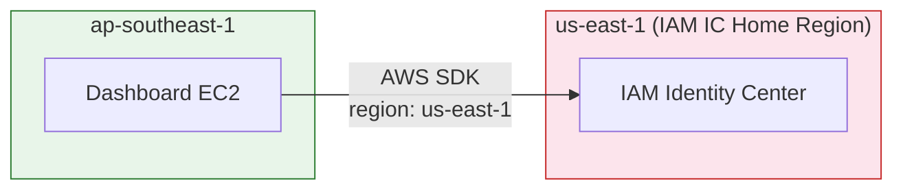
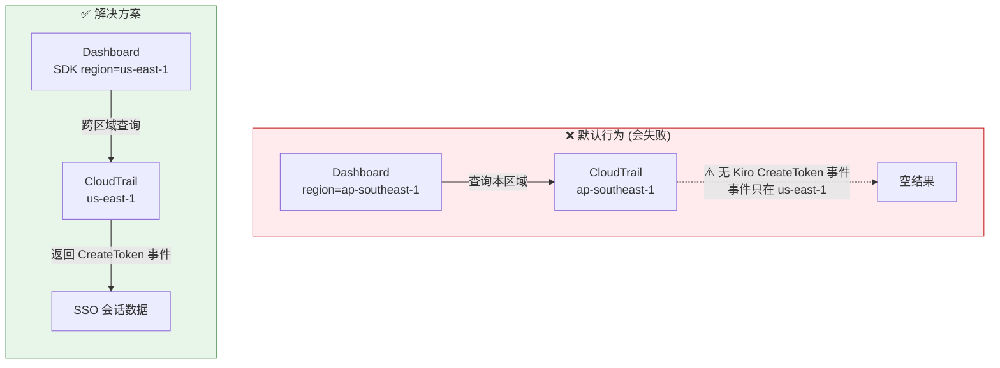
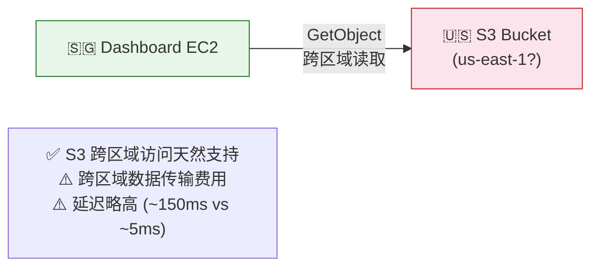
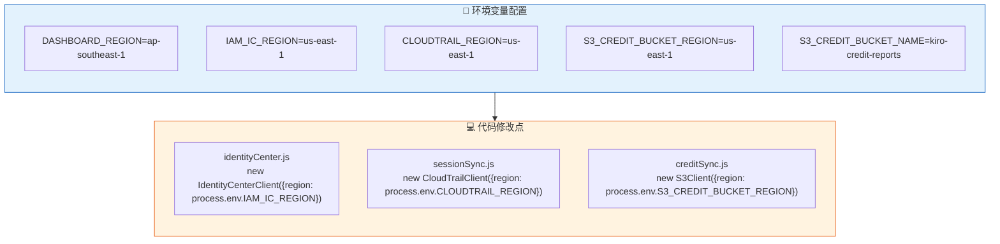
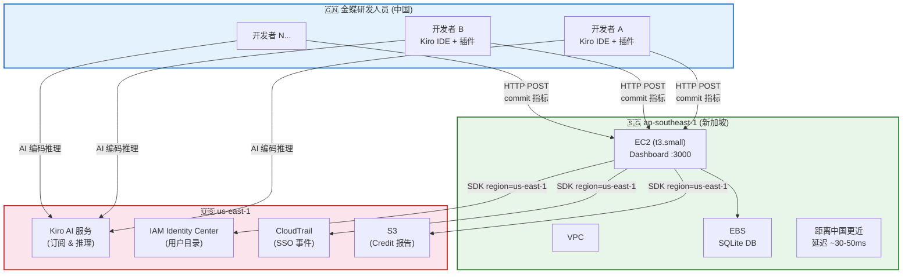

# Kiro Coding Metrics Collector — 跨区域部署分析

> **场景：** Kiro 订阅在 us-east-1，Dashboard EC2 + SQLite 部署在 ap-southeast-1 (新加坡)  
> **核心问题：** 同账号不同区域部署是否可行？有什么注意事项？

---

## ✅ 结论：可以部署，但需处理 3 个跨区域问题



---

## 🔍 逐项分析

### 1️⃣ 插件 → Dashboard (HTTP POST)：✅ 无问题



**结论：** 插件到 Dashboard 是普通 HTTP 请求，跟 Kiro 服务在哪个区域无关。只要 EC2 有公网访问入口（公网IP/ALB/VPN），插件就能上报数据。

---

### 2️⃣ IAM Identity Center 同步：⚠️ 需要配置跨区域



**关键点：**
- IAM Identity Center 是**单区域服务**，只在一个 "Home Region" 中运行
- 通常 Home Region = 首次启用 IAM IC 时的区域（很可能是 us-east-1）
- Dashboard 代码中需要**显式指定 IAM IC 的区域**，而非使用 EC2 所在区域

**代码修改示例：**
```javascript
// identityCenter.js — 需要显式指定区域
const client = new IdentityCenterClient({
  region: 'us-east-1',  // ← IAM IC Home Region，不是 EC2 所在区域
});
```

---

### 3️⃣ CloudTrail 会话同步：⚠️ 需要跨区域 Trail 或 SDK 指向



**关键点：**
- Kiro 使用 us-east-1 的 SSO 端点进行认证
- `CreateToken` 事件只记录在 **us-east-1 的 CloudTrail** 中
- Dashboard 必须跨区域查询 us-east-1 的 CloudTrail

**两种解决方式：**

| 方案 | 做法 | 优缺点 |
|------|------|--------|
| **A. SDK 指定区域** | CloudTrail SDK client 指向 us-east-1 | ✅ 简单，零额外成本<br/>⚠️ 跨区域 API 延迟 ~100-200ms |
| **B. Organization Trail** | 启用组织级多区域 Trail，事件汇聚到 S3 | ✅ 所有区域事件集中<br/>❌ 需额外配置 + S3 费用 |

**推荐方案 A，代码修改：**
```javascript
// sessionSync.js
const cloudtrailClient = new CloudTrailClient({
  region: 'us-east-1',  // ← Kiro SSO 事件所在区域
});
```

---

### 4️⃣ S3 Credit 用量报告：⚠️ 确认 Bucket 所在区域



**关键点：**
- S3 是全局服务，跨区域读取无需特殊配置
- 但会产生**跨区域数据传输费** ($0.02/GB us-east-1 → ap-southeast-1)
- Credit 报告数据量不大（KB级），成本可忽略

---

## 📋 完整注意事项清单

```mermaid
mindmap
  root((跨区域部署<br/>注意事项))
    AWS SDK 配置
      IAM IC client 指向 Home Region
      CloudTrail client 指向 us-east-1
      S3 client 指向 Bucket 所在区域
      不要依赖 EC2 metadata 自动获取区域
    网络与安全
      EC2 安全组开放插件上报端口
      EC2 需要公网出口访问 us-east-1 服务
      VPC Endpoint 仅限本区域服务加速
      跨区域调用走 AWS 骨干网(不走公网)
    成本考量
      跨区域 API 调用无额外费用
      S3 跨区域传输 $0.02/GB
      CloudTrail LookupEvents 查询免费
      主要成本在 EC2 + 数据传输
    延迟影响
      us-east-1 → ap-southeast-1 ~180ms RTT
      CloudTrail 定时同步(非实时) 无感
      插件上报是异步重试 对延迟不敏感
      Dashboard 前端查询走本地 SQLite 无跨区域延迟
    运维注意
      环境变量区分各服务区域
      监控跨区域 API 调用失败率
      CloudTrail 可能有 ~15min 事件延迟
      IAM IC Home Region 不可迁移
```

---

## 🛠️ 推荐的配置方式



---

## 🏗️ 最终部署拓扑



---

## ⚡ 为什么新加坡是个好选择（对金蝶研发人员来说）

| 对比维度 | Dashboard 在 us-east-1 | Dashboard 在 ap-southeast-1 |
|----------|----------------------|---------------------------|
| 中国开发者 → Dashboard 延迟 | ~200-250ms | ~30-50ms ✅ |
| Dashboard → IAM IC / CloudTrail | 本地调用 ~5ms | 跨区域 ~180ms |
| 影响用户体验？ | 插件上报慢（可感知） | **后台同步慢（不可感知）** ✅ |
| 管理员查看 Dashboard | 慢 | 快 ✅ |

**结论：** Dashboard 放新加坡对用户体验更优 — 插件上报和管理员访问都更快。跨区域的 IAM/CloudTrail/S3 同步是定时后台任务，额外延迟对用户不可见。

---

## ⚠️ 关键风险与缓解

| 风险 | 影响 | 缓解措施 |
|------|------|----------|
| IAM IC Home Region 判断错误 | 用户同步失败 | 部署前确认：AWS Console → IAM IC → Settings → Region |
| CloudTrail 跨区域查询限流 | 会话同步失败 | 降低同步频率(默认5min→15min) + 指数退避重试 |
| S3 Bucket 不在 us-east-1 | 读取失败 | 确认 Bucket 区域，配置正确的 region |
| EC2 无法访问 us-east-1 API | 所有 AWS 同步失败 | 确保 VPC 有 NAT Gateway 或公网出口 |
| SQLite 文件锁 + EBS 单 AZ | 数据丢失风险 | 定期 EBS Snapshot + 考虑 RDS 替代 |
