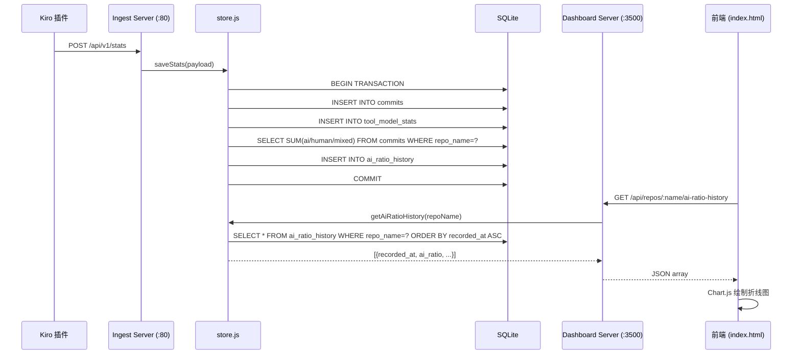
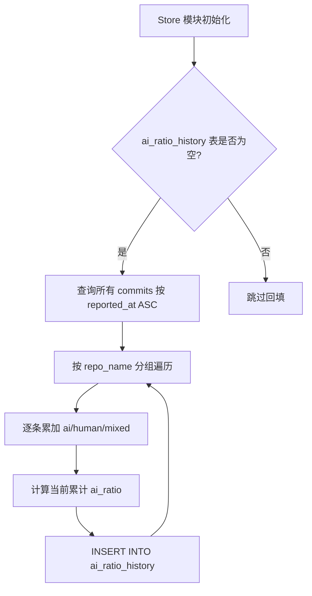

# Design Document: AI Ratio History Chart

## Overview

本功能为 kiro-dashboard 新增 AI 代码占比历史趋势追踪能力。核心流程：

1. 在 SQLite 中新增 `ai_ratio_history` 表，存储每次提交后的 AI 占比快照
2. 在 `store.js` 的 `saveStats()` 事务中，自动计算并记录当前仓库的累计 AI 占比
3. 首次初始化时，回填已有 commit 数据生成历史快照
4. 新增 Dashboard API 端点 `/api/repos/:name/ai-ratio-history` 返回历史数据
5. 前端仓库详情 modal 中使用 Chart.js 绘制 AI 占比趋势折线图

设计原则：
- 使用 Chart.js CDN：前端图表使用 Chart.js 库，减少手写绘图代码和潜在 bug
- 事务一致性：快照写入与 commit 保存在同一事务中
- 增量记录：每次 ingest 只追加一条快照，查询时按时间排序即可

## Architecture



### 初始化回填流程



## Components and Interfaces

### 1. Store 层 (store.js) — 新增/修改

#### 新增表创建 (在 `db.exec()` 中追加)

```sql
CREATE TABLE IF NOT EXISTS ai_ratio_history (
  id INTEGER PRIMARY KEY AUTOINCREMENT,
  repo_name TEXT NOT NULL,
  recorded_at TEXT NOT NULL,
  ai_ratio REAL NOT NULL,
  ai_additions INTEGER NOT NULL,
  human_additions INTEGER NOT NULL,
  mixed_additions INTEGER NOT NULL,
  commit_sha TEXT NOT NULL
);

CREATE INDEX IF NOT EXISTS idx_ai_ratio_history_repo_time
  ON ai_ratio_history(repo_name, recorded_at);
```

#### 新增函数: `recordAiRatioSnapshot(repoName, commitSha)`

在事务内调用，计算该仓库当前累计 AI 占比并插入快照。

```pseudocode
function recordAiRatioSnapshot(repoName, commitSha):
  row = SELECT SUM(ai_additions), SUM(human_additions), SUM(mixed_additions)
        FROM commits WHERE repo_name = repoName
  total = row.human + row.ai + row.mixed
  if total == 0: return  // 跳过
  ratio = row.ai / total
  INSERT INTO ai_ratio_history (repo_name, recorded_at, ai_ratio,
    ai_additions, human_additions, mixed_additions, commit_sha)
  VALUES (repoName, now(), ratio, row.ai, row.human, row.mixed, commitSha)
```

#### 修改函数: `saveStats(payload)`

在现有事务末尾追加调用 `recordAiRatioSnapshot(p.repo_name, p.commit_sha)`。

#### 新增函数: `getAiRatioHistory(repoName)`

```pseudocode
function getAiRatioHistory(repoName):
  return SELECT recorded_at, ai_ratio, ai_additions, human_additions,
                mixed_additions, commit_sha
         FROM ai_ratio_history
         WHERE repo_name = repoName
         ORDER BY recorded_at ASC
```

#### 新增函数: `backfillAiRatioHistory()`

初始化时调用，仅在表为空时执行。

```pseudocode
function backfillAiRatioHistory():
  count = SELECT COUNT(*) FROM ai_ratio_history
  if count > 0: return  // 已有数据，跳过

  commits = SELECT repo_name, commit_sha, reported_at,
                   ai_additions, human_additions, mixed_additions
            FROM commits ORDER BY reported_at ASC

  // 按仓库维护累计值
  accumulators = {}  // repo_name -> {ai, human, mixed}

  BEGIN TRANSACTION
  for each commit in commits:
    acc = accumulators[commit.repo_name] || {ai:0, human:0, mixed:0}
    acc.ai += commit.ai_additions
    acc.human += commit.human_additions
    acc.mixed += commit.mixed_additions
    accumulators[commit.repo_name] = acc

    total = acc.ai + acc.human + acc.mixed
    if total == 0: continue
    ratio = acc.ai / total

    INSERT INTO ai_ratio_history (repo_name, recorded_at, ai_ratio,
      ai_additions, human_additions, mixed_additions, commit_sha)
    VALUES (commit.repo_name, commit.reported_at, ratio,
            acc.ai, acc.human, acc.mixed, commit.commit_sha)
  COMMIT
```

### 2. Dashboard 层 (dashboard.js) — 新增路由

新增 API 路由处理：

```pseudocode
// 匹配 /api/repos/<name>/ai-ratio-history
if url matches "/api/repos/*/ai-ratio-history" AND method == GET:
  repoName = extractRepoName(url)
  history = store.getAiRatioHistory(repoName)
  sendJson(res, 200, history)
```

路由匹配逻辑：在现有 `/api/repos/` 路由分支中，检查路径是否以 `/ai-ratio-history` 结尾，优先于 `/aggregate` 分支处理。

### 3. 前端 (index.html) — 使用 Chart.js 绘制图表

#### CDN 引入

在 `index.html` 的 `<head>` 中通过 CDN 引入 Chart.js：

```html
<script src="https://cdn.jsdelivr.net/npm/chart.js"></script>
```

#### 图表渲染函数: `renderAiRatioChart(container, data)`

输入：
- `container`: DOM 元素，图表将渲染到此容器中
- `data`: `[{recorded_at, ai_ratio, ...}]` 数组

行为：
- 数据点 < 2 时，显示 "数据不足，暂无趋势图"
- 使用 Chart.js Line chart API 渲染折线图
- X 轴：时间（日期格式）
- Y 轴：AI 占比（0% ~ 100%）
- Chart.js 内置 tooltip 支持，悬停显示具体日期和百分比值
- 不再需要手动绘制坐标轴、网格线、数据点等

#### Chart.js 配置

```pseudocode
function renderAiRatioChart(container, data):
  if data.length < 2:
    container.innerHTML = "数据不足，暂无趋势图"
    return

  canvas = createElement("canvas")
  container.appendChild(canvas)

  new Chart(canvas, {
    type: "line",
    data: {
      labels: data.map(d => new Date(d.recorded_at).toLocaleDateString("zh-CN")),
      datasets: [{
        label: "AI 占比",
        data: data.map(d => (d.ai_ratio * 100).toFixed(1)),
        borderColor: "#58a6ff",
        backgroundColor: "rgba(88, 166, 255, 0.1)",
        fill: true,
        tension: 0.3,
        pointRadius: 3,
        pointBackgroundColor: "#58a6ff"
      }]
    },
    options: {
      responsive: true,
      plugins: {
        tooltip: {
          callbacks: {
            label: (ctx) => "AI 占比: " + ctx.parsed.y + "%"
          }
        },
        legend: { display: false }
      },
      scales: {
        x: {
          ticks: { color: "#8b949e" },
          grid: { color: "#21262d" }
        },
        y: {
          min: 0, max: 100,
          ticks: {
            color: "#8b949e",
            callback: (v) => v + "%"
          },
          grid: { color: "#21262d" }
        }
      }
    }
  })
```

#### Modal 集成

在 `showDetail()` 函数中，在"汇总统计"表格之后、"按开发者"表格之前插入图表容器：

```pseudocode
// 在汇总统计 table 之后
html += '<div class="section-title">AI 占比趋势</div>'
html += '<div id="ai-ratio-chart"></div>'
// 然后是按开发者 section

// 在 content.innerHTML = html 之后
fetchAndRenderChart(repoName)
```

## Data Models

### ai_ratio_history 表

| 列名 | 类型 | 约束 | 说明 |
|------|------|------|------|
| id | INTEGER | PRIMARY KEY AUTOINCREMENT | 自增主键 |
| repo_name | TEXT | NOT NULL | 仓库名称 |
| recorded_at | TEXT | NOT NULL | 记录时间 (ISO 8601) |
| ai_ratio | REAL | NOT NULL | AI 占比 (0.0 ~ 1.0) |
| ai_additions | INTEGER | NOT NULL | 截至该时刻的累计 AI 行数 |
| human_additions | INTEGER | NOT NULL | 截至该时刻的累计人类行数 |
| mixed_additions | INTEGER | NOT NULL | 截至该时刻的累计混合行数 |
| commit_sha | TEXT | NOT NULL | 触发该快照的 commit SHA |

索引：`idx_ai_ratio_history_repo_time ON (repo_name, recorded_at)` — 支持按仓库+时间范围高效查询。

### API 响应格式

`GET /api/repos/:name/ai-ratio-history`

```json
[
  {
    "recorded_at": "2024-01-15T10:30:00.000Z",
    "ai_ratio": 0.35,
    "ai_additions": 120,
    "human_additions": 200,
    "mixed_additions": 23,
    "commit_sha": "abc12345"
  }
]
```

空数据或仓库不存在时返回 `[]`，HTTP 200。

## Correctness Properties

*A property is a characteristic or behavior that should hold true across all valid executions of a system — essentially, a formal statement about what the system should do. Properties serve as the bridge between human-readable specifications and machine-verifiable correctness guarantees.*

### Property 1: Cumulative AI ratio snapshot correctness

*For any* sequence of commit payloads saved to a repository, after each `saveStats()` call, the most recent `ai_ratio_history` record for that repository SHALL have `ai_ratio` equal to `SUM(ai_additions) / SUM(ai_additions + human_additions + mixed_additions)` computed across all commits for that repository, and the snapshot SHALL contain the correct cumulative `ai_additions`, `human_additions`, `mixed_additions`, and the triggering `commit_sha`.

**Validates: Requirements 2.1, 2.2**

### Property 2: History API response ordering and completeness

*For any* repository with AI ratio history records, the response from `GET /api/repos/:name/ai-ratio-history` SHALL return records sorted by `recorded_at` in strictly ascending order, and each record SHALL contain the fields `recorded_at`, `ai_ratio`, `ai_additions`, `human_additions`, `mixed_additions`, and `commit_sha`.

**Validates: Requirements 3.1, 3.2**

### Property 3: Backfill running cumulative ratio correctness

*For any* set of existing commits across one or more repositories, when the backfill function replays commits in `reported_at` ascending order, each generated snapshot SHALL have `ai_ratio` equal to the running cumulative `SUM(ai_additions) / SUM(ai_additions + human_additions + mixed_additions)` for that repository up to and including that commit, and the total number of snapshots SHALL equal the number of commits with non-zero cumulative totals.

**Validates: Requirements 5.1, 5.2**

## Error Handling

| 场景 | 处理方式 |
|------|----------|
| `saveStats` 事务中快照插入失败 | 整个事务回滚，commit 和快照都不保存，返回错误 |
| `getAiRatioHistory` 查询失败 | 捕获异常，打印错误日志，返回空数组 `[]` |
| 回填过程中数据库错误 | 事务回滚，打印错误日志，不影响服务启动 |
| API 请求的 repo_name 包含特殊字符 | URL decode 后直接用于 SQL 参数化查询，无注入风险 |
| Canvas 绘制失败 | 前端 try-catch 捕获，显示 "图表加载失败" 提示；Chart.js CDN 加载失败时同样降级显示提示 |
| 网络请求 `/ai-ratio-history` 失败 | 前端 catch 错误，在图表区域显示错误信息 |
| 回填时 `reported_at` 为 null | 使用 `created_at` 作为 fallback，若都为 null 则跳过该条记录 |

## Testing Strategy

### 属性测试 (Property-Based Testing)

本功能的核心逻辑（AI 占比计算、数据排序、回填累计）适合属性测试。使用 `fast-check` 库进行属性测试。

- 属性测试库：`fast-check` (JavaScript)
- 每个属性测试最少运行 100 次迭代
- 每个测试用注释标注对应的设计文档属性编号
- 标签格式：`Feature: ai-ratio-history-chart, Property {number}: {property_text}`

#### 属性测试覆盖

| 属性 | 测试内容 | 生成策略 |
|------|----------|----------|
| Property 1 | 累计 AI 占比计算正确性 | 生成随机 commit 序列（ai/human/mixed 为 0~10000 的整数），逐条保存后验证快照 |
| Property 2 | API 返回排序和字段完整性 | 生成随机时间戳的历史记录，查询后验证升序排列和字段存在 |
| Property 3 | 回填累计比率正确性 | 生成多仓库随机 commit 集合，执行回填后验证每条快照的 running cumulative ratio |

### 单元测试 (Example-Based)

| 测试场景 | 对应需求 |
|----------|----------|
| 累计总量为零时不插入快照 | 2.3 |
| 无历史记录的仓库返回空数组 | 3.3 |
| 不存在的仓库返回空数组 | 3.4 |
| 数据点 < 2 时显示提示文字 | 4.4 |
| 回填只执行一次（幂等性） | 5.3 |
| 事务一致性：快照与 commit 同时成功或失败 | 2.4 |

### 集成测试

| 测试场景 | 说明 |
|----------|------|
| 完整 ingest → 查询 → 渲染流程 | 发送 POST /api/v1/stats，然后 GET /ai-ratio-history，验证数据一致 |
| 回填后 API 返回正确数据 | 先插入 commits，触发回填，验证 API 返回 |
