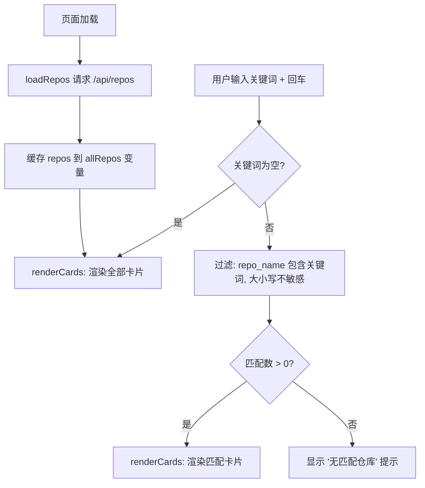

# 设计文档：Dashboard 仓库搜索

## 概述

在 kiro-dashboard 前端页面（`public/index.html`）中增加搜索功能，允许用户通过关键词按名称筛选仓库卡片。这是一个纯前端功能，不涉及后端改动。所有逻辑在现有的内联 `<script>` 中完成。

## 架构

本功能仅修改 `agent-support/kiro-dashboard/public/index.html`，在现有页面结构中：

1. 在刷新按钮旁添加搜索输入框
2. 用一个模块级变量缓存从 API 加载的仓库数据
3. 监听搜索框的 `keydown` 事件，按回车触发过滤
4. 根据过滤结果重新渲染卡片区域



## 组件与接口

### 新增 DOM 元素

- **搜索输入框** (`<input id="search-input">`): 放置在刷新按钮右侧，`placeholder="搜索仓库..."`，样式与暗色主题一致。
- 使用一个容器 `<div>` 将刷新按钮和搜索框包裹在一起，便于布局。

### 新增/修改的 JavaScript 函数

| 函数 | 说明 |
|------|------|
| `let allRepos = []` | 模块级变量，缓存 API 返回的完整仓库列表 |
| `loadRepos()` (修改) | 加载后将数据存入 `allRepos`，然后调用 `renderCards(allRepos)` |
| `renderCards(repos)` (新增) | 接收仓库数组，渲染卡片到 `#app`；空数组时显示"无匹配仓库" |
| `handleSearch()` (新增) | 读取搜索框值，过滤 `allRepos`，调用 `renderCards` |

### 过滤逻辑

```javascript
const keyword = searchInput.value.trim().toLowerCase();
const filtered = keyword === ''
  ? allRepos
  : allRepos.filter(r => r.repo_name.toLowerCase().includes(keyword));
```

## 数据模型

无新增数据模型。使用现有 `/api/repos` 返回的仓库对象数组，每个对象包含 `repo_name` 字段用于匹配。

## 错误处理

- 搜索框为空时按回车：显示全部仓库（已在过滤逻辑中处理）
- 无匹配结果：在 `#app` 中显示 `<div class="empty">无匹配仓库</div>`
- API 加载失败：保持现有错误处理逻辑不变

## 测试策略

### PBT 适用性评估

本功能不适合属性基测试（PBT），原因：
- 核心逻辑是简单的数组过滤 + DOM 渲染，无复杂数据变换
- 过滤逻辑为一行 `Array.filter` + `String.includes`，无需大量随机输入验证
- 功能与 DOM 紧密耦合

### 单元测试（example-based）

使用 `vitest` + `jsdom` 环境进行测试：

1. **搜索框渲染**: 验证页面包含 `#search-input`，placeholder 为 "搜索仓库..."
2. **关键词过滤**: 给定仓库列表 `["Foo", "bar", "fooBar"]`，搜索 "foo" 应返回 `["Foo", "fooBar"]`（大小写不敏感）
3. **空搜索**: 搜索框为空时按回车，应显示全部仓库卡片
4. **无匹配**: 搜索不存在的关键词，应显示"无匹配仓库"提示

由于本功能逻辑极简且与 DOM 耦合，手动验证（在浏览器中测试）也是有效的验证方式。
