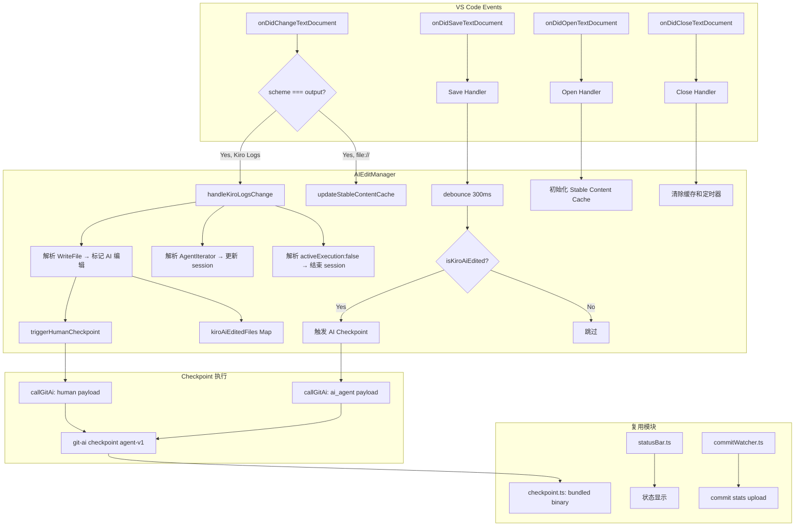
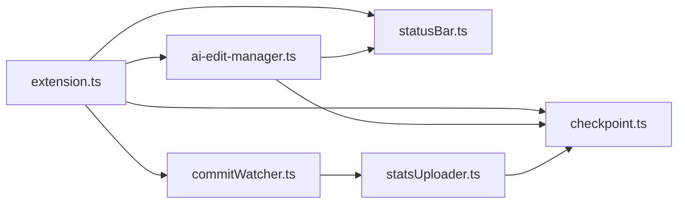

# 设计文档

## 概述

本设计将 `agent-support/kiro` 插件的 AI 编辑检测机制从基于 `fs.watch()` 监听 Kiro globalStorage 执行日志 JSON 文件的方案，重构为基于 Kiro Logs Output Channel 日志事件监听的方案。

核心变更：
- 新建 `ai-edit-manager.ts` 模块，替代 `logWatcher.ts` 和 `logParser.ts`
- 通过 `vscode.workspace.onDidChangeTextDocument` 监听 Kiro Logs Output Channel（`scheme === "output"`）
- 解析 `[WriteFile]`、`[AgentIterator]` 等日志事件标记 AI 编辑文件
- 结合 `onDidSaveTextDocument` 触发 checkpoint
- 维护 Stable Content Cache 用于 human checkpoint 的编辑前基线
- 复用 `checkpoint.ts` 中的 binary 管理和 checkpoint 调用逻辑

**设计决策理由：**
- Output Channel 监听比 fs.watch 更可靠：不依赖文件系统事件的平台差异，不需要轮询重试
- 实时性更好：日志写入即可检测，无需等待执行日志 JSON 文件完成写入
- 架构更简洁：无需解析复杂的执行日志 JSON 结构，只需匹配简单的日志关键字

## 架构



### 关键节点数据结构

**① onDidChangeTextDocument 事件（Output Channel）**

```typescript
// event.document.uri
{
  scheme: "output",           // Output Channel 的 URI scheme
  fsPath: "...Kiro Logs...",  // 包含 "Kiro Logs" 标识
}

// event.contentChanges[n].text — 新增的日志文本片段，示例：
// "[AgentIterator] Syncing.../path/to/file.ts"
// "[WriteFile] completed writing to /path/to/file.ts"
// "...activeExecution\":false..."
```

**② kiroAiEditedFiles Map（AI 编辑标记）**

```typescript
// Map<filePath, timestamp>
{
  "/Users/dev/project/src/app.ts": 1712745600000,  // Date.now() 时间戳
  "/Users/dev/project/src/utils.ts": 1712745601500,
}
// 查询时：Date.now() - timestamp < 15_000 → AI 编辑；否则过期清除
```

**③ stableFileContent Map（编辑前基线缓存）**

```typescript
// Map<filePath, fileContent>
{
  "/Users/dev/project/src/app.ts": "import React from 'react';\n...",  // 文件打开时或静默 2s 后的内容
}
// 用于 Human Checkpoint 的 dirty_files，确保记录的是 AI 编辑前的内容
```

**④ Human Checkpoint Payload（传给 git-ai stdin）**

```typescript
{
  type: "human",
  repo_working_dir: "/Users/dev/project",
  will_edit_filepaths: ["/Users/dev/project/src/app.ts"],
  dirty_files: {
    "/Users/dev/project/src/app.ts": "编辑前的稳定内容（来自 stableFileContent）"
  }
}
```

**⑤ AI Checkpoint Payload（传给 git-ai stdin）**

```typescript
{
  type: "ai_agent",
  repo_working_dir: "/Users/dev/project",
  agent_name: "kiro",
  model: "kiro-ai",
  conversation_id: "kiro-1712745600000",  // session ID
  edited_filepaths: ["/Users/dev/project/src/app.ts"],
  dirty_files: {
    "/Users/dev/project/src/app.ts": "AI 编辑后的内容（从 TextDocument 内存获取）"
  },
  transcript: { messages: [{ type: "assistant", text: "Kiro AI edit" }] }
}
```

**⑥ Session 状态**

```typescript
{
  kiroSessionId: "kiro-1712745600000",  // [AgentIterator] 首次出现时生成
  kiroAgentActive: true,                // [AgentIterator] → true; activeExecution:false → false
}
```

### 数据流

1. Kiro agent 执行操作 → 写入 Kiro Logs Output Channel
2. `onDidChangeTextDocument` 捕获 Output Channel 变更
3. `AIEditManager` 解析日志，提取 `[WriteFile]` 事件中的文件路径
4. 检测到 WriteFile → 使用 Stable Content Cache 触发 human checkpoint → 标记文件为 AI 编辑
5. 文件保存事件触发 → debounce 后检查 AI 编辑标记 → 触发 AI checkpoint
6. checkpoint 通过 bundled binary 执行 `git-ai checkpoint agent-v1`

## 组件与接口

### AIEditManager 类

```typescript
// agent-support/kiro/src/ai-edit-manager.ts

import * as vscode from "vscode";
import { spawn } from "node:child_process";
import {
  getGitAiBinary,
  isBinaryReady,
  getIgnorePatterns,
  matchesIgnorePattern,
} from "./checkpoint";
import type { StatusBar } from "./statusBar";

export class AIEditManager implements vscode.Disposable {
  // --- 公共接口 ---
  constructor();
  setStatusBar(statusBar: StatusBar): void;
  start(): void;  // 注册所有 VS Code 事件监听器
  dispose(): void; // 清除所有定时器、缓存、监听器

  // --- 事件处理器（由 start() 内部注册） ---
  private handleDocumentChange(event: vscode.TextDocumentChangeEvent): void;
  private handleDocumentSave(doc: vscode.TextDocument): void;
  private handleDocumentOpen(doc: vscode.TextDocument): void;
  private handleDocumentClose(doc: vscode.TextDocument): void;

  // --- Kiro Logs 解析 ---
  private handleKiroLogsChange(event: vscode.TextDocumentChangeEvent): void;
  private isKiroAiEdited(filePath: string): boolean;

  // --- Checkpoint 触发 ---
  private evaluateSaveForCheckpoint(filePath: string): void;
  private triggerHumanCheckpoint(filePaths: string[]): void;
  private triggerAiCheckpoint(filePath: string): void;
  private callGitAi(cwd: string, payload: object): Promise<boolean>;

  // --- 辅助方法 ---
  private getDirtyFiles(): Record<string, string>;
  private resolveWorkingDir(filePath: string): string | null;
  private updateStableContent(filePath: string, content: string): void;
}
```

### 模块依赖关系



### extension.ts 变更

```typescript
// 移除:
// import { KiroLogWatcher } from "./logWatcher";

// 新增:
import { AIEditManager } from "./ai-edit-manager";

export function activate(context: vscode.ExtensionContext) {
  const statusBar = new StatusBar();
  context.subscriptions.push(statusBar);

  initBundledBinary(context.extensionPath);

  if (!isBinaryReady()) {
    statusBar.setState("inactive");
    return;
  }

  // 配置 git shim（保持不变）
  // ...

  // 替换 KiroLogWatcher 为 AIEditManager
  const aiEditManager = new AIEditManager();
  aiEditManager.setStatusBar(statusBar);
  aiEditManager.start();
  statusBar.setState("watching");

  context.subscriptions.push(aiEditManager);

  // CommitWatcher 保持不变
  const commitWatcher = new CommitWatcher();
  commitWatcher.start();
  context.subscriptions.push(commitWatcher);
}
```

### checkpoint.ts 变更

移除对 `logParser.ts` 的类型依赖（`FileEdit`、`ParsedExecution`），移除 `runCheckpoint` 函数。保留以下公共 API：

```typescript
// 保留的公共 API
export function initBundledBinary(extensionPath: string): void;
export function getGitAiBinary(): string | null;
export function getGitShimPath(): string | null;
export function isBinaryReady(): boolean;
export function getIgnorePatterns(): string[];
export function matchesIgnorePattern(filePath: string, patterns: string[]): boolean;

// 新增：供 AIEditManager 调用的通用 checkpoint 函数
export function callCheckpointAgentV1(cwd: string, payload: object): Promise<boolean>;
```

`callCheckpointAgentV1` 从现有的 `callGitAi` 函数重构而来，保持相同的 spawn 逻辑和错误处理。

## 数据模型

### AI 编辑文件映射

```typescript
// filePath → 标记时间戳
private kiroAiEditedFiles = new Map<string, number>();
```

- Key: 文件绝对路径（从 WriteFile 日志中提取）
- Value: `Date.now()` 时间戳
- 过期策略: 查询时检查是否超过 `KIRO_AI_EDIT_COOLDOWN_MS`（15秒），超过则删除

### Stable Content Cache

```typescript
// filePath → 文件稳定内容
private stableFileContent = new Map<string, string>();
// filePath → debounce 定时器
private stableContentTimers = new Map<string, NodeJS.Timeout>();
```

- 文件打开时初始化缓存
- 文件内容变更后 2 秒静默期更新缓存
- 文件关闭时清除缓存和定时器
- Human checkpoint 使用缓存内容作为 dirty_files

### Session 状态

```typescript
private kiroSessionId: string = `kiro-${Date.now()}`;
private kiroAgentActive: boolean = false;
```

- 首次检测到 `[AgentIterator]` 时生成新 session ID
- 检测到 `activeExecution":false` 时标记为非活跃

### Debounce 定时器

```typescript
// 保存事件 debounce
private pendingSaves = new Map<string, {
  timestamp: number;
  timer: NodeJS.Timeout;
}>();

// Human checkpoint debounce
private lastHumanCheckpointAt = new Map<string, number>();
```

### Checkpoint Payload 格式

**Human Checkpoint:**
```json
{
  "type": "human",
  "repo_working_dir": "/path/to/workspace",
  "will_edit_filepaths": ["/path/to/file.ts"],
  "dirty_files": {
    "/path/to/file.ts": "文件编辑前的稳定内容"
  }
}
```

**AI Checkpoint:**
```json
{
  "type": "ai_agent",
  "repo_working_dir": "/path/to/workspace",
  "agent_name": "kiro",
  "model": "kiro-ai",
  "conversation_id": "kiro-1234567890",
  "edited_filepaths": ["/path/to/file.ts"],
  "dirty_files": {
    "/path/to/file.ts": "文件当前内容（从 TextDocument 获取）"
  },
  "transcript": {
    "messages": [{ "type": "assistant", "text": "Kiro AI edit" }]
  }
}
```


## 正确性属性

*正确性属性是在系统所有有效执行中都应成立的特征或行为——本质上是对系统应做什么的形式化陈述。属性是人类可读规范与机器可验证正确性保证之间的桥梁。*

### 属性 1：Output Channel 事件过滤

*对于任何* 文档变更事件，AIEditManager 应当且仅当 `document.uri.scheme === "output"` 且文档标识包含 "Kiro Logs" 时才进行日志解析处理；其他所有事件应被忽略。

**验证需求: 1.1, 1.5**

### 属性 2：WriteFile 日志解析与路径提取

*对于任何* 包含 `[WriteFile]` 关键字和有效文件路径的日志文本，解析函数应正确提取出完整的文件路径，且提取的路径应与日志中记录的路径一致。

**验证需求: 1.2**

### 属性 3：Agent 状态机转换

*对于任何* 日志事件序列，当检测到 `[AgentIterator]` 时 agent 状态应为活跃且生成新 session ID；当检测到 `activeExecution":false` 时 agent 状态应为非活跃。状态转换应是幂等的（连续多个 AgentIterator 不应重复生成 session ID）。

**验证需求: 1.3, 1.4**

### 属性 4：AI 编辑标记与时间窗口

*对于任何* 被标记为 AI 编辑的文件路径和任意查询时间点，当查询时间与标记时间的差值小于 15 秒时 `isKiroAiEdited` 应返回 true，当差值大于等于 15 秒时应返回 false 并清除标记。多次标记同一文件应更新时间戳为最新值。

**验证需求: 2.1, 2.2, 2.3**

### 属性 5：Checkpoint 触发决策

*对于任何* 文件保存事件，当该文件在 AI_Edit_Window 内被标记为 AI 编辑时应触发 AI checkpoint；当该文件未被标记或标记已过期时应跳过 checkpoint。

**验证需求: 3.2, 3.3**

### 属性 6：Human Checkpoint Payload 构造

*对于任何* 有效的文件路径列表和 Stable Content Cache 内容，构造的 human checkpoint payload 应包含 `type: "human"`、`repo_working_dir`、`will_edit_filepaths`（与输入文件列表一致）和 `dirty_files`（使用缓存的稳定内容）。

**验证需求: 5.2**

### 属性 7：AI Checkpoint Payload 构造

*对于任何* 有效的文件路径、session ID 和文件内容，构造的 AI checkpoint payload 应包含 `type: "ai_agent"`、`repo_working_dir`、`agent_name: "kiro"`、`model: "kiro-ai"`、`conversation_id`（等于 session ID）、`edited_filepaths`、`dirty_files` 和 `transcript` 字段。

**验证需求: 5.3**

### 属性 8：Stable Content 用于 Human Checkpoint

*对于任何* 文件，当文件打开时其内容应被缓存到 Stable Content Cache；当 WriteFile 事件触发 human checkpoint 时，payload 中的 dirty_files 应使用缓存的稳定内容（编辑前基线），而非当前可能已被 AI 修改的内容。

**验证需求: 4.1, 4.3**

### 属性 9：忽略模式过滤

*对于任何* 文件路径和忽略模式列表，当文件路径匹配任何忽略模式时，该文件不应被标记为 AI 编辑，也不应触发 checkpoint。

**验证需求: 9.1, 9.2**

## 错误处理

| 场景 | 处理方式 |
|------|---------|
| Bundled binary 不存在 | `isBinaryReady()` 返回 false，状态栏显示 "inactive"，跳过所有 checkpoint |
| checkpoint 命令执行失败（非零退出码） | 记录错误日志到 console，状态栏短暂显示 "failure"，不影响后续检测 |
| Kiro Logs Output Channel 未找到 | 事件过滤自动跳过，不产生错误，等待 Channel 出现 |
| 日志格式异常（无法解析文件路径） | 静默跳过该条日志，不影响其他日志处理 |
| workspace 目录无法确定 | 记录警告日志，跳过该次 checkpoint |
| Stable Content Cache 中无缓存内容 | 回退到从 TextDocument 获取当前内容 |
| 文件路径匹配忽略模式 | 静默跳过，记录 debug 日志 |

## 测试策略

### 属性测试（Property-Based Testing）

使用 `fast-check` 库进行属性测试，每个属性测试最少运行 100 次迭代。

**可测试的纯逻辑函数（从 AIEditManager 中提取）：**

1. **isKiroLogsDocument(scheme, identifier)** — 判断文档是否为 Kiro Logs（属性 1）
2. **parseWriteFilePath(logText)** — 从日志文本提取文件路径（属性 2）
3. **updateAgentState(currentState, logText)** — 状态机转换（属性 3）
4. **isWithinEditWindow(markTimestamp, queryTimestamp, windowMs)** — 时间窗口判断（属性 4）
5. **shouldTriggerCheckpoint(filePath, aiEditedFiles, now)** — checkpoint 决策（属性 5）
6. **buildHumanPayload(workingDir, filePaths, dirtyFiles)** — human payload 构造（属性 6）
7. **buildAiPayload(workingDir, filePath, sessionId, dirtyFiles)** — AI payload 构造（属性 7）
8. **matchesIgnorePattern(filePath, patterns)** — 忽略模式匹配（属性 9，复用现有函数）

每个属性测试需标注对应的设计属性：
- 标签格式: **Feature: kiro-logs-ai-edit-detection, Property {number}: {property_text}**

### 单元测试（Example-Based）

- Debounce 行为验证（保存事件 300ms、human checkpoint 500ms）
- Stable Content Cache 生命周期（打开→缓存→变更→更新→关闭→清除）
- checkpoint 成功后清除 AI 编辑标记
- 状态栏状态转换序列
- Binary 不可用时的降级行为
- dispose 后资源完全释放

### 集成测试

- Extension 激活流程：AIEditManager 创建、事件监听器注册、StatusBar 初始化
- 端到端流程：模拟 Kiro Logs 变更 → AI 编辑标记 → 文件保存 → checkpoint 触发
