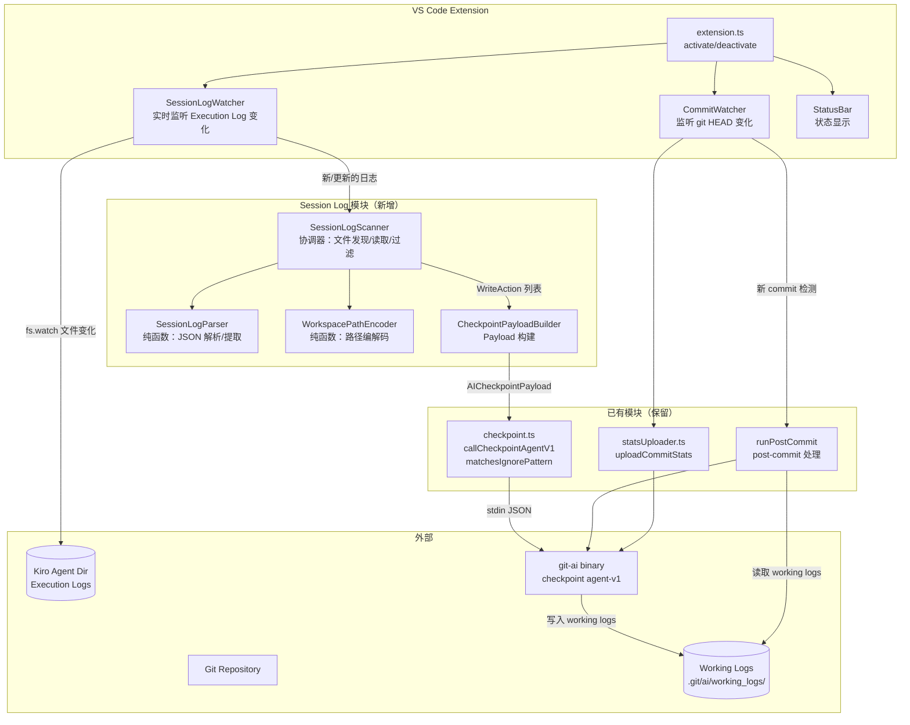
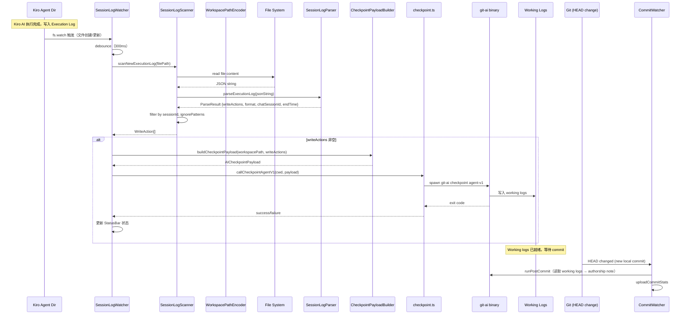

# 技术设计文档：Kiro Session Monitor

## 概述

Kiro Session Monitor 完全替代已被证明不可靠的 Output Channel 监听方案（`AIEditManager`）。新方案通过 `fs.watch` 实时监听 Kiro IDE 持久化到磁盘的 Execution Log 目录变化，当检测到新的或更新的执行日志时，立即解析 AI 代码编辑记录并调用 `callCheckpointAgentV1` 将 AI 编辑数据写入 git-ai working logs。这保留了原有 `AIEditManager` 的实时 checkpoint 行为——AI 编辑在发生时就被记录到 working logs，而非等到 commit 时才处理。

### 核心设计决策

1. **完全移除 Output Channel 监听**：Output Channel 事件仅在面板可见时触发（[VS Code #171334](https://github.com/microsoft/vscode/issues/171334)），导致 AI 编辑检测不可靠。新方案读取 Kiro 已持久化到磁盘的 Execution Log，完全不依赖 Output Channel，`AIEditManager` 及其所有相关代码将被彻底删除。

2. **实时监听 Session Log 变化**：通过 `fs.watch` 监听 Kiro Agent Dir 下的执行日志目录，当新的 Execution Log 文件被创建或更新时，立即解析并提取 AI 写操作。检测到 `actionState === "Accepted"` 的写操作后，立即调用 `callCheckpointAgentV1` 将数据写入 git-ai working logs。这与原有 `AIEditManager` 的行为一致——AI 编辑在发生时就被记录，后续 `CommitWatcher` 检测到 commit 时，`runPostCommit` 会读取 working logs 生成 authorship note。

3. **纯函数解析 + 协调器模式**：将日志解析（纯函数，无 I/O）与文件系统操作（协调器）分离，便于属性测试和单元测试。

4. **双格式兼容**：同时支持 Format A（`actions` 数组，数据完整）和 Format B（`context.messages`，作为 fallback），确保所有 Kiro 工作流类型的 AI 编辑都能被检测。

## 架构

### 系统架构图



### 数据流



## 组件与接口

### 1. WorkspacePathEncoder（纯函数模块）

**职责**：工作区绝对路径与 URL-safe Base64 编码之间的转换。

**文件**：`src/workspacePathEncoder.ts`

```typescript
/**
 * 将工作区绝对路径编码为 URL-safe Base64 字符串。
 * 使用 Node.js 内置的 base64url 编码（`-` 替代 `+`，`_` 替代 `/`，无尾部 `=`）。
 */
export function encodeWorkspacePath(workspacePath: string): string;

/**
 * 将 URL-safe Base64 字符串解码回原始工作区绝对路径。
 */
export function decodeWorkspacePath(encoded: string): string;
```

**设计决策**：直接使用 `Buffer.from(str).toString("base64url")`，这是 Node.js 内置的 URL-safe Base64 实现，与 Kiro IDE 的编码行为一致。不做路径规范化——Windows 反斜杠和 macOS 正斜杠原样编码。

### 2. SessionLogParser（纯函数模块）

**职责**：解析单个 Execution Log JSON，提取 WriteAction 列表。自动检测 Format A/B 并返回统一输出。

**文件**：`src/sessionLogParser.ts`

```typescript
/** 写操作类型集合 */
export const WRITE_ACTION_TYPES: Set<string>;

/** 从 Format A actions 数组提取写操作 */
export function extractFormatAWriteActions(actions: unknown[]): WriteAction[];

/** 从 Format B context.messages 提取写操作 */
export function extractFormatBWriteActions(messages: unknown[]): WriteAction[];

/** 主入口：解析 JSON 字符串，自动检测格式，返回统一结果 */
export function parseExecutionLog(jsonString: string): ParseResult;

/** 解析 sessions.json，提取 session ID 列表 */
export function parseSessionsJson(jsonString: string): string[];
```

**格式检测逻辑**：
- 如果 JSON 包含非空 `actions` 数组 → 使用 Format A 提取
- 否则检查 `context.messages` → 使用 Format B 提取
- 任何解析错误 → 返回空结果，不抛异常

**Format A 提取规则**：
- 仅提取 `actionState === "Accepted"` 的 action
- `actionType` 必须在 `WRITE_ACTION_TYPES` 集合中
- 从 `input` 对象提取 `file`、`originalContent`、`modifiedContent`
- `create` 类型的 `originalContent` 设为空字符串
- 结果按 `emittedAt` 升序排序

**Format B 提取规则**：
- 扫描 `role: "bot"` 消息中的 `toolUse` 条目
- 工具名必须在 `["fsWrite", "strReplace", "fsAppend", "deleteFile"]` 中
- 通过 `id` 字段匹配 `toolUseResponse`，仅保留 `success === true` 的调用
- 从 `args` 提取文件路径和内容

### 3. SessionLogScanner（协调器模块）

**职责**：编排文件系统操作——发现、读取、过滤 Execution Log 文件，调用 SessionLogParser 解析。

**文件**：`src/sessionLogScanner.ts`

```typescript
export const MAX_FILE_SIZE: number;      // 5 MB

/** 按 session ID 过滤（纯函数，可测试） */
export function filterBySessionId(
  logs: ParseResult[],
  sessionIds: Set<string>
): ParseResult[];

export class SessionLogScanner {
  constructor(agentDir?: string);

  /** 跨平台解析 Agent Dir 路径 */
  static resolveAgentDir(
    platform?: string,
    homeDir?: string,
    appData?: string
  ): string;

  /** 解析单个执行日志文件并提取 WriteAction */
  async parseExecutionLogFile(filePath: string): Promise<ParseResult | null>;

  /** 获取当前工作区关联的 session ID 集合 */
  async getWorkspaceSessionIds(workspacePath: string): Promise<Set<string>>;

  /** 扫描指定工作区的所有 AI 编辑（用于按需查询） */
  async scanForAIEdits(
    workspacePath: string,
    beforeTimestamp: number,
    windowMs?: number
  ): Promise<ScanResult>;
}
```

**跨平台路径解析**：
| 平台 | Agent Dir 路径 |
|------|---------------|
| macOS | `~/Library/Application Support/Kiro/User/globalStorage/kiro.kiroagent/` |
| Windows | `%APPDATA%\Kiro\User\globalStorage\kiro.kiroagent\` |
| Linux | `~/.config/Kiro/User/globalStorage/kiro.kiroagent/` |

### 4. SessionLogWatcher（实时监听模块，新增核心组件）

**职责**：通过 `fs.watch` 实时监听 Kiro Agent Dir 下的执行日志目录变化，当检测到新的或更新的 Execution Log 文件时，触发解析和 checkpoint 流程。这是替代 `AIEditManager` 的核心组件。

**文件**：`src/sessionLogWatcher.ts`

```typescript
import * as fs from "node:fs";
import * as vscode from "vscode";
import { SessionLogScanner } from "./sessionLogScanner";
import { buildCheckpointPayload } from "./checkpointPayload";
import { callCheckpointAgentV1, getIgnorePatterns } from "./checkpoint";
import type { StatusBar } from "./statusBar";

/** Debounce window for file change events. */
const FILE_CHANGE_DEBOUNCE_MS = 300;

export class SessionLogWatcher implements vscode.Disposable {
  private scanner: SessionLogScanner;
  private statusBar: StatusBar | null = null;
  private watchers: fs.FSWatcher[] = [];
  private processedFiles = new Set<string>();
  /** 记录每个文件上次处理时的大小，用于检测增量更新 */
  private lastProcessedSize = new Map<string, number>();
  private pendingChanges = new Map<string, NodeJS.Timeout>();
  private workspacePath: string;
  private sessionIds: Set<string> = new Set();

  constructor(workspacePath: string, scanner?: SessionLogScanner);

  setStatusBar(statusBar: StatusBar): void;

  /** 启动监听：记录已有文件快照，初始化 session IDs，设置 fs.watch */
  async start(): Promise<void>;

  /** 处理文件变化事件（带 debounce） */
  private handleFileChange(eventType: string, filename: string): void;

  /** 解析新的/更新的执行日志并触发 checkpoint */
  private async processExecutionLog(filePath: string): Promise<void>;

  dispose(): void;
}
```

**监听策略**：

1. **启动时**：
   - 解析 Agent Dir 路径
   - 读取 `workspace-sessions/<base64>/sessions.json` 获取当前工作区的 session ID 集合
   - 遍历 Agent Dir 下的 `<workspace-hash>/414d*/` 目录
   - 记录所有已存在文件的大小（用于去重），**但不处理它们**——只关心启动后的变化
   - 对每个 `414d*` 目录调用 `fs.watch` 监听文件变化
   - 对每个 `<workspace-hash>` 父目录也调用 `fs.watch`，以捕获启动后新创建的 `414d*` 子目录

2. **文件变化时**：
   - `fs.watch` 回调触发
   - Debounce 300ms（Kiro 可能分多次写入同一文件）
   - 检查文件大小是否与启动时记录的不同（新文件或大小变化才处理）
   - 读取并解析执行日志
   - 按 `chatSessionId` 过滤，仅处理当前工作区的日志
   - 提取 `actionState === "Accepted"` 的写操作
   - 构建 checkpoint payload 并调用 `callCheckpointAgentV1`

3. **Checkpoint 触发**：
   - 先发送 human checkpoint（使用 `originalContent` 作为 pre-edit 基线）
   - 再发送 AI checkpoint（使用 `modifiedContent` 作为 AI 编辑后内容）
   - checkpoint 数据写入 git-ai working logs
   - 后续 `CommitWatcher` 检测到 commit 时，`runPostCommit` 读取 working logs 生成 authorship note

4. **去重机制**：
   - 启动时记录所有已存在文件的路径和大小
   - 新文件（未记录过）直接处理
   - 已存在文件大小未变化时跳过
   - 文件大小变化时重新解析（Kiro 可能追加内容到同一执行日志）

### 4. CheckpointPayloadBuilder（工具模块）

**职责**：将 WriteAction 列表转换为 `callCheckpointAgentV1` 所需的 `AICheckpointPayload` 格式。

**文件**：`src/checkpointPayload.ts`

```typescript
/**
 * 从 WriteAction 列表构建 AICheckpointPayload。
 *
 * dirty_files 策略：
 * - Format A（有 originalContent）：使用 originalContent 作为 dirty_files 值
 * - Format B（无 originalContent）：从磁盘读取当前文件内容
 */
export async function buildCheckpointPayload(
  workspacePath: string,
  actions: WriteAction[],
  chatSessionId?: string,
  ignorePatterns?: string[]
): Promise<AICheckpointPayload>;
```

**Payload 结构**：
```typescript
{
  type: "ai_agent",
  repo_working_dir: workspacePath,
  agent_name: "kiro",
  model: "kiro-ai",
  conversation_id: chatSessionId,
  edited_filepaths: string[],       // 去重后的文件路径列表
  dirty_files: Record<string, string>, // 文件路径 → 修改前内容
  transcript: { messages: [{ type: "assistant", text: "Kiro AI edit" }] }
}
```

### 6. extension.ts 集成变更

**移除**：
- `AIEditManager` 类及其源文件 `src/ai-edit-manager.ts`
- 所有 `import { AIEditManager }` 语句
- 所有 Output Channel 监听逻辑（`onDidChangeTextDocument` + `scheme === "output"`）
- 所有仅服务于 Output Channel 方案的辅助函数

**新增**：
- 创建 `SessionLogWatcher` 实例，替代 `AIEditManager`
- `SessionLogWatcher` 在 `activate` 时启动，实时监听 Execution Log 变化并写入 working logs
- `CommitWatcher` 保持不变——它只负责 `runPostCommit`（读取 working logs 生成 authorship note）和 `uploadCommitStats`

**修改后的 activate 函数伪代码**：
```typescript
export function activate(context: vscode.ExtensionContext) {
  const statusBar = new StatusBar();
  initBundledBinary(context.extensionPath);
  cleanupGitPathOverride(context.extensionPath);

  if (!isBinaryReady()) {
    statusBar.setState("inactive");
    return;
  }

  statusBar.setState("watching");

  // 获取当前工作区路径
  const workspacePath = vscode.workspace.workspaceFolders?.[0]?.uri.fsPath;

  if (workspacePath) {
    // 创建 SessionLogWatcher（替代 AIEditManager）
    // 实时监听 Kiro Execution Log 变化，检测到 AI 编辑后立即写入 working logs
    const watcher = new SessionLogWatcher(workspacePath);
    watcher.setStatusBar(statusBar);
    watcher.start(); // 异步启动，不阻塞 activate
    context.subscriptions.push(watcher);
  }

  // CommitWatcher 保持不变：检测 commit → runPostCommit → uploadCommitStats
  const commitWatcher = new CommitWatcher();
  commitWatcher.start();
  context.subscriptions.push(statusBar, commitWatcher);
}
```

### 7. CommitWatcher 不变

**设计决策**：`CommitWatcher` 不需要修改。它的职责保持不变：
1. 监听 git HEAD 变化
2. 检测到新的本地 commit 时调用 `runPostCommit`（读取 working logs → 生成 authorship note）
3. 调用 `uploadCommitStats` 上传统计数据

Working logs 的写入由 `SessionLogWatcher` 实时完成，`CommitWatcher` 只需要在 commit 时读取它们。这与原有 `AIEditManager` 的架构一致——`AIEditManager` 在文件保存时写入 working logs，`CommitWatcher` 在 commit 时读取。

## 数据模型

### WriteAction

```typescript
interface WriteAction {
  /** 操作类型：replace, create, write, append, editCode, delete, smartRelocate */
  actionType: string;
  /** 相对于工作区的文件路径 */
  filePath: string;
  /** 修改前的完整文件内容（仅 Format A 提供） */
  originalContent?: string;
  /** 修改后的完整文件内容 */
  modifiedContent?: string;
  /** 操作时间戳（毫秒，仅 Format A 提供） */
  emittedAt?: number;
}
```

### ParseResult

```typescript
interface ParseResult {
  /** 提取的写操作列表 */
  writeActions: WriteAction[];
  /** 检测到的日志格式 */
  format: "A" | "B";
  /** 关联的 chat session ID */
  chatSessionId?: string;
  /** 执行结束时间戳（毫秒） */
  endTime?: number;
}
```

### ScanResult

```typescript
interface ScanResult {
  /** 聚合的写操作列表（已过滤） */
  writeActions: WriteAction[];
  /** 成功扫描的文件数 */
  scannedFiles: number;
  /** 跳过的文件数（读取失败、超大等） */
  skippedFiles: number;
}
```

### AICheckpointPayload

```typescript
interface AICheckpointPayload {
  type: "ai_agent";
  repo_working_dir: string;
  agent_name: "kiro";
  model: "kiro-ai";
  conversation_id?: string;
  edited_filepaths: string[];
  dirty_files: Record<string, string>;
  transcript: {
    messages: Array<{ type: string; text: string }>;
  };
}
```

### Execution Log 格式（外部数据）

#### Format A（带 actions 数组）

```typescript
interface FormatALog {
  executionId: string;
  workflowType: string;
  status: string;
  startTime: number;
  endTime: number;
  chatSessionId: string;
  actions: Array<{
    actionType: string;
    actionState: "Accepted" | "Error" | "Success";
    input: {
      file: string;
      originalContent?: string;
      modifiedContent?: string;
    };
    emittedAt: number;
  }>;
  context?: { messages: unknown[] };
}
```

#### Format B（仅 context.messages）

```typescript
interface FormatBLog {
  executionId: string;
  workflowType: string;
  status: string;
  startTime: number;
  endTime: number;
  chatSessionId: string;
  context: {
    messages: Array<{
      role: "human" | "bot" | "tool";
      entries: Array<{
        id: string;
        type: "toolUse" | "toolUseResponse" | string;
        name?: string;
        args?: Record<string, unknown>;
        success?: boolean;
      }>;
    }>;
  };
}
```


## 正确性属性

*属性（Property）是在系统所有有效执行中都应成立的特征或行为——本质上是对系统应做什么的形式化陈述。属性是人类可读规格说明与机器可验证正确性保证之间的桥梁。*

### Property 1: 跨平台 Agent Dir 路径解析

*For any* 平台标识符（"darwin" | "win32" | "linux"）和任意 home 目录路径，`resolveAgentDir` 应返回包含该平台对应后缀的路径：macOS 为 `Library/Application Support/Kiro/User/globalStorage/kiro.kiroagent`，Windows 为 `Kiro\User\globalStorage\kiro.kiroagent`，Linux 为 `.config/Kiro/User/globalStorage/kiro.kiroagent`。

**Validates: Requirements 1.1, 1.2, 1.3**

### Property 2: 工作区路径编码 round-trip

*For any* 字符串（包括含反斜杠的 Windows 路径和含正斜杠的 Unix 路径），`decodeWorkspacePath(encodeWorkspacePath(s))` 应等于原始字符串 `s`。

**Validates: Requirements 2.3, 2.4, 2.5**

### Property 3: URL-safe Base64 字符集

*For any* 字符串，`encodeWorkspacePath` 的输出应仅包含 URL-safe Base64 字符集 `[A-Za-z0-9_-]`，不包含 `+`、`/` 或尾部 `=` 填充符。

**Validates: Requirements 2.1**

### Property 4: Format A 提取仅返回 Accepted 的写操作

*For any* actions 数组（包含各种 actionType 和 actionState 的混合），`extractFormatAWriteActions` 返回的每个 WriteAction 都应来自 `actionState === "Accepted"` 且 `actionType` 在 `WRITE_ACTION_TYPES` 集合中的 action。

**Validates: Requirements 3.1, 3.2**

### Property 5: Format A 字段提取保留所有相关字段

*For any* 有效的 Format A action（actionState 为 "Accepted"，actionType 为写操作类型），提取的 WriteAction 应保留 `filePath`（来自 `input.file`）、`emittedAt` 时间戳，以及根据 actionType 正确设置的 `originalContent` 和 `modifiedContent`（create 类型的 originalContent 为空字符串）。结果应按 `emittedAt` 升序排序。

**Validates: Requirements 3.3, 3.4, 3.5, 3.6, 3.7, 6.6**

### Property 6: 格式自动检测

*For any* 有效的执行日志 JSON，如果包含非空 `actions` 数组，`parseExecutionLog` 应返回 `format === "A"`；如果不包含 `actions` 数组但包含 `context.messages`，应返回 `format === "B"`。

**Validates: Requirements 4.1, 5.1, 5.2, 5.3**

### Property 7: Format B 工具调用提取与字段映射

*For any* Format B 消息数组，`extractFormatBWriteActions` 应仅从 `role: "bot"` 消息中提取 `["fsWrite", "strReplace", "fsAppend", "deleteFile"]` 工具调用，并正确映射字段：fsWrite/fsAppend 的 `args.path` → `filePath`、`args.text` → `modifiedContent`；strReplace 的 `args.path` → `filePath`；deleteFile 的 `args.targetFile` → `filePath`。

**Validates: Requirements 4.2, 4.3, 4.4, 4.5, 4.6**

### Property 8: 失败的工具调用被排除

*For any* Format B 消息数组，当 `toolUse` 条目有对应的 `toolUseResponse`（通过 `id` 匹配）且 `success === false` 时，该工具调用不应出现在提取结果中。

**Validates: Requirements 4.7**

### Property 9: 解析鲁棒性

*For any* 任意字符串输入，`parseExecutionLog` 不应抛出异常，且应返回一个包含 `writeActions` 数组字段的有效 `ParseResult` 对象。

**Validates: Requirements 5.5**

### Property 10: 时间窗口过滤

*For any* ParseResult 列表和时间窗口参数 `[beforeTimestamp - windowMs, beforeTimestamp]`，`filterByTimeWindow` 返回的每个结果的 `endTime` 都应落在该时间窗口内。

**Validates: Requirements 6.2**

### Property 11: Session ID 过滤

*For any* ParseResult 列表和 session ID 集合，`filterBySessionId` 返回的每个结果的 `chatSessionId` 都应在给定的 session ID 集合中。

**Validates: Requirements 6.3**

### Property 12: Checkpoint Payload 固定字段与结构

*For any* WriteAction 列表和工作区路径，`buildCheckpointPayload` 生成的 payload 应满足：`type === "ai_agent"`、`agent_name === "kiro"`、`model === "kiro-ai"`、`repo_working_dir` 等于输入的工作区路径，且 `edited_filepaths` 不包含重复项。

**Validates: Requirements 7.2, 7.3, 7.6**

### Property 13: WriteAction 序列化 round-trip

*For any* 有效的 WriteAction 列表，序列化为 JSON 后再反序列化应产生等价的 WriteAction 列表，保留所有字段（`filePath`、`actionType`、`emittedAt`、`originalContent`、`modifiedContent`）。

**Validates: Requirements 11.3, 11.4**

## 错误处理

### 错误处理策略

本模块采用**静默降级**策略——所有错误都被捕获并记录日志，不中断主流程。这是因为 AI 归因是辅助功能，不应影响用户的正常 git 工作流。

### 错误场景与处理

| 错误场景 | 处理方式 | 影响 |
|---------|---------|------|
| Agent Dir 不存在 | 记录 warning，SessionLogWatcher 不启动监听 | 无 AI 归因，但不影响其他功能 |
| sessions.json 不存在或损坏 | 记录 warning，fallback 到扫描所有目录 | 可能扫描到其他工作区的日志 |
| fs.watch 失败（权限/平台限制） | 记录 error，SessionLogWatcher 降级为不监听 | 无实时 AI 归因 |
| 单个执行日志文件读取失败 | 跳过该文件，记录 warning | 可能遗漏部分 AI 编辑 |
| 执行日志 JSON 解析失败 | 返回空 WriteAction 列表 | 该日志的 AI 编辑被忽略 |
| 执行日志文件过大（>5MB） | 跳过该文件，记录 warning | 该日志的 AI 编辑被忽略 |
| checkpoint 调用失败 | 记录 error，继续监听后续变化 | 该次 AI 编辑未写入 working logs |
| 文件权限不足（EACCES/EPERM） | 记录 error，跳过该文件 | 该文件的 AI 编辑被忽略 |
| fs.watch 事件风暴（大量文件同时变化） | debounce 300ms 合并事件 | 短暂延迟，不丢数据 |

### 日志前缀

所有日志使用 `[git-ai-kiro]` 前缀，与现有模块保持一致。

## 测试策略

### 双重测试方法

本功能采用**属性测试 + 单元测试**的双重测试策略：

- **属性测试（Property-Based Testing）**：使用 `fast-check` 库验证纯函数模块的通用属性，每个属性测试运行至少 100 次迭代
- **单元测试（Example-Based Testing）**：验证具体场景、边界条件和集成行为

### 属性测试配置

- **库**：`fast-check`（已在 `devDependencies` 中）
- **运行器**：`vitest`（已配置）
- **最小迭代次数**：100 次/属性
- **标签格式**：`Feature: kiro-session-monitor, Property {number}: {property_text}`

### 测试文件规划

| 测试文件 | 类型 | 覆盖模块 | 覆盖属性 |
|---------|------|---------|---------|
| `workspacePathEncoder.property.test.ts` | 属性测试 | WorkspacePathEncoder | Property 2, 3 |
| `sessionLogParser.property.test.ts` | 属性测试 | SessionLogParser | Property 4, 5, 6, 7, 8, 9, 13 |
| `sessionLogScanner.property.test.ts` | 属性测试 | SessionLogScanner (纯函数) | Property 1, 10, 11 |
| `checkpointPayload.property.test.ts` | 属性测试 | CheckpointPayloadBuilder | Property 12 |
| `sessionLogScanner.unit.test.ts` | 单元测试 | SessionLogScanner (集成) | Requirements 1.4, 6.1, 6.4, 6.5 |
| `sessionLogWatcher.unit.test.ts` | 单元测试 | SessionLogWatcher (实时监听) | Requirements 8.1-8.5, 10.5-10.8 |
| `extensionIntegration.unit.test.ts` | 单元测试 | extension.ts 集成 | Requirements 10.1-10.6 |

### 纯函数模块的属性测试重点

1. **WorkspacePathEncoder**：round-trip 属性、URL-safe 字符集属性
2. **SessionLogParser**：格式检测、字段提取、过滤逻辑、鲁棒性
3. **SessionLogScanner 纯函数**：`resolveAgentDir`、`filterBySessionId`、`filterByTimeWindow`
4. **CheckpointPayloadBuilder**：固定字段、去重、结构正确性

### 集成测试重点

1. **SessionLogWatcher 实时监听**：验证 fs.watch 触发后正确解析日志并调用 checkpoint
2. **SessionLogWatcher debounce**：验证快速连续的文件变化被正确合并
3. **SessionLogWatcher 去重**：验证同一文件不被重复处理
4. **extension.ts 集成**：验证 AIEditManager 已移除，SessionLogWatcher 正确替代
5. **文件系统交互**：使用临时目录模拟 Kiro Agent Dir 结构
6. **错误处理**：验证各种失败场景下的静默降级行为

### Mock 策略

- `vscode` 模块：使用 `vi.mock("vscode", ...)` 提供最小实现
- 文件系统：属性测试中不涉及 I/O（纯函数）；集成测试使用临时目录
- `checkpoint.ts`：属性测试中 mock `getIgnorePatterns` 和 `matchesIgnorePattern`
