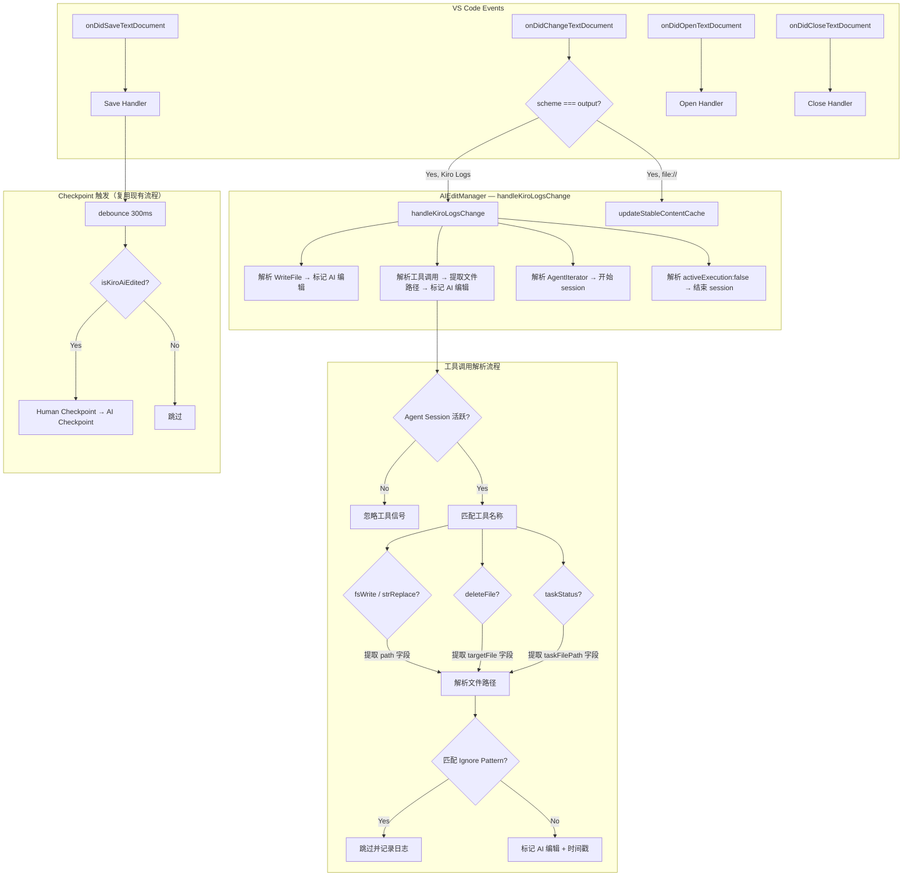
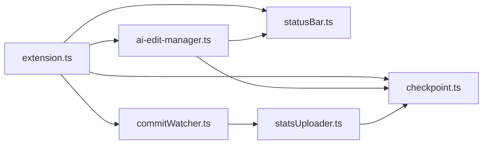

# 设计文档

## 概述

本设计扩展 `agent-support/kiro` 插件中 `AIEditManager` 的 AI 编辑检测机制，使其除了现有的 `[WriteFile]` 模式外，还能识别 Kiro Logs 中基于工具调用（`fsWrite`、`strReplace`、`taskStatus` 等）的文件写入信号。

### 核心变更

- 在 `handleKiroLogsChange` 方法中新增工具调用日志解析逻辑
- 从工具调用的 JSON 参数中提取文件路径（`path`、`targetFile`、`taskFilePath` 字段）
- 仅在 Agent Session 活跃期间处理工具调用信号
- 复用现有的 ignore pattern 过滤、cooldown 窗口、checkpoint 触发流程

### 设计决策理由

- **扩展而非重写**：在现有 `handleKiroLogsChange` 中添加工具调用解析，保持架构一致性
- **JSON 参数提取**：工具调用日志以 JSON 格式记录参数，从中提取文件路径最为可靠
- **Session 感知**：仅在 `kiroAgentActive === true` 时处理工具信号，避免误标记人类操作
- **统一 checkpoint 流程**：工具调用标记的文件与 `[WriteFile]` 标记的文件使用完全相同的 checkpoint 逻辑

### Kiro Logs 工具调用日志格式

**重要说明**：当前代码库中没有 Kiro Logs 工具调用的样本日志。基于对 Kiro IDE 行为的分析，工具调用在 Kiro Logs Output Channel 中以 JSON 格式记录参数。以下是预期的日志格式模式：

```
// fsWrite 工具调用 — 日志中包含 "path" 字段
..."fsWrite"...{"path":"src/app.ts","text":"..."}...

// strReplace 工具调用 — 日志中包含 "path" 字段
..."strReplace"...{"path":"src/app.ts","oldStr":"...","newStr":"..."}...

// deleteFile 工具调用 — 日志中包含 "targetFile" 字段
..."deleteFile"...{"targetFile":"src/old.ts","explanation":"..."}...

// taskStatus 工具调用 — 日志中包含 "taskFilePath" 字段
..."taskStatus"...{"taskFilePath":".kiro/specs/feature/tasks.md","task":"...","status":"..."}...
```

**格式发现策略**：由于无法在代码库中找到确切的日志格式样本，设计采用以下策略：
1. 使用宽松的正则匹配工具名称（如 `fsWrite`、`strReplace`、`taskStatus`、`deleteFile`）
2. 使用 JSON 字段提取模式匹配 `"path"`、`"targetFile"`、`"taskFilePath"` 字段值
3. 在实现阶段添加调试日志，捕获实际的工具调用日志格式以验证和调整解析逻辑
4. 解析逻辑设计为容错的——无法提取路径时静默跳过，不影响其他日志处理

## 架构



### 数据流

1. Kiro agent 执行 spec 任务 → 调用 fsWrite/strReplace/taskStatus 等工具
2. 工具调用日志写入 Kiro Logs Output Channel
3. `onDidChangeTextDocument` 捕获 Output Channel 变更
4. `handleKiroLogsChange` 解析日志：
   - 检测 `[WriteFile]` → 直接提取路径（现有逻辑）
   - 检测工具名称（fsWrite/strReplace/taskStatus/deleteFile）→ 提取 JSON 参数中的文件路径（新增逻辑）
5. 文件路径通过 ignore pattern 过滤后标记为 AI 编辑
6. 文件保存事件触发 → debounce → 检查 AI 编辑标记 → 触发 human + AI checkpoint（复用现有流程）

## 组件与接口

### AIEditManager 类变更

在现有 `AIEditManager` 类中新增以下方法和修改：

```typescript
// agent-support/kiro/src/ai-edit-manager.ts

export class AIEditManager implements vscode.Disposable {
  // --- 现有字段（保持不变）---
  private kiroAiEditedFiles: Map<string, number>;
  private stableFileContent: Map<string, string>;
  private stableContentTimers: Map<string, NodeJS.Timeout>;
  private preAgentSnapshot: Map<string, string>;
  private pendingSaves: Map<string, { timestamp: number; timer: NodeJS.Timeout }>;
  private kiroSessionId: string;
  private kiroAgentActive: boolean;
  private statusBar: StatusBar | null;
  private disposables: vscode.Disposable[];

  // --- 现有方法（保持不变）---
  constructor();
  setStatusBar(statusBar: StatusBar): void;
  start(): void;
  dispose(): void;
  private handleDocumentChange(event: vscode.TextDocumentChangeEvent): void;
  private handleDocumentSave(doc: vscode.TextDocument): void;
  private handleDocumentOpen(doc: vscode.TextDocument): void;
  private handleDocumentClose(doc: vscode.TextDocument): void;
  private isKiroAiEdited(filePath: string): boolean;
  private resolveWorkingDir(filePath: string): string | null;
  private evaluateSaveForCheckpoint(filePath: string): void;

  // --- 修改的方法 ---
  private handleKiroLogsChange(event: vscode.TextDocumentChangeEvent): void;
  // 扩展：在现有 [WriteFile] 解析之后，新增工具调用解析逻辑

  // --- 新增方法 ---
  /**
   * 从工具调用日志文本中提取文件路径。
   * 识别 fsWrite、strReplace、deleteFile、taskStatus 等工具，
   * 从 JSON 参数中提取 path、targetFile、taskFilePath 字段。
   * @returns 提取到的文件绝对路径数组，无法提取时返回空数组
   */
  private extractToolCallPaths(text: string): string[];

  /**
   * 将相对路径解析为基于工作区根目录的绝对路径。
   * @returns 绝对路径，或在无法解析时返回 null
   */
  private resolveToAbsolutePath(filePath: string): string | null;
}
```

### 新增纯函数（可测试）

为了支持属性测试，从 `AIEditManager` 中提取以下纯函数：

```typescript
// agent-support/kiro/src/ai-edit-manager.ts（导出供测试使用）

/**
 * 已知的文件写入工具名称列表。
 */
export const FILE_WRITE_TOOLS = ["fsWrite", "strReplace", "deleteFile", "fsAppend"] as const;

/**
 * 已知的任务状态工具名称。
 */
export const TASK_STATUS_TOOL = "taskStatus" as const;

/**
 * 从日志文本中提取工具调用涉及的文件路径。
 * 纯函数，不依赖 VS Code API。
 *
 * @param text - Kiro Logs 中的日志文本片段
 * @param agentActive - 当前 agent session 是否活跃
 * @returns 提取到的文件路径数组（可能为相对路径）
 */
export function parseToolCallPaths(text: string, agentActive: boolean): string[];

/**
 * 从日志文本中提取指定 JSON 字段的值。
 * 支持 "path"、"targetFile"、"taskFilePath" 字段。
 *
 * @param text - 包含 JSON 参数的日志文本
 * @param fieldName - 要提取的字段名
 * @returns 字段值，未找到时返回 null
 */
export function extractJsonFieldValue(text: string, fieldName: string): string | null;
```

### 模块依赖关系（无变化）



## 数据模型

### 现有数据结构（保持不变）

所有现有数据结构保持不变，工具调用检测到的文件路径使用相同的 `kiroAiEditedFiles` Map 进行标记：

```typescript
// AI 编辑文件映射 — 工具调用和 [WriteFile] 共用
private kiroAiEditedFiles = new Map<string, number>();
// Key: 文件绝对路径
// Value: Date.now() 时间戳
// 过期策略: 15 秒 cooldown（KIRO_AI_EDIT_COOLDOWN_MS）

// Session 状态 — 工具调用解析依赖此状态
private kiroSessionId: string;
private kiroAgentActive: boolean;
// 工具调用仅在 kiroAgentActive === true 时被处理
```

### 工具名称与字段映射

```typescript
// 工具名称 → 文件路径字段名的映射关系
const TOOL_PATH_FIELDS: Record<string, string> = {
  fsWrite:    "path",         // {"path": "src/app.ts", "text": "..."}
  strReplace: "path",         // {"path": "src/app.ts", "oldStr": "...", "newStr": "..."}
  fsAppend:   "path",         // {"path": "src/app.ts", "text": "..."}
  deleteFile: "targetFile",   // {"targetFile": "src/old.ts", "explanation": "..."}
  taskStatus: "taskFilePath", // {"taskFilePath": ".kiro/specs/.../tasks.md", ...}
};
```

### Checkpoint Payload 格式（无变化）

工具调用标记的文件使用与 `[WriteFile]` 完全相同的 checkpoint payload 格式：

**Human Checkpoint:**
```json
{
  "type": "human",
  "repo_working_dir": "/path/to/workspace",
  "will_edit_filepaths": ["/path/to/file.ts"],
  "dirty_files": {
    "/path/to/file.ts": "编辑前的稳定内容（preAgentSnapshot 或 stableFileContent）"
  }
}
```

**AI Checkpoint:**
```json
{
  "type": "ai_agent",
  "repo_working_dir": "/path/to/workspace",
  "agent_name": "kiro",
  "model": "kiro-ai",
  "conversation_id": "kiro-1234567890",
  "edited_filepaths": ["/path/to/file.ts"],
  "dirty_files": {
    "/path/to/file.ts": "文件当前内容（从 TextDocument 获取）"
  },
  "transcript": {
    "messages": [{ "type": "assistant", "text": "Kiro AI edit" }]
  }
}
```


## 正确性属性

*正确性属性是在系统所有有效执行中都应成立的特征或行为——本质上是对系统应做什么的形式化陈述。属性是人类可读规范与机器可验证正确性保证之间的桥梁。*

### 属性 1：工具调用文件路径提取

*对于任何* 已知的文件写入工具名称（fsWrite、strReplace、fsAppend、deleteFile、taskStatus）和任意有效文件路径字符串，当日志文本包含该工具名称及对应的 JSON 路径字段（path、targetFile 或 taskFilePath）时，`parseToolCallPaths` 函数应正确提取出该文件路径，且提取的路径与原始路径一致。

**Validates: Requirements 1.1, 1.2, 1.3, 4.1, 4.2, 4.3**

### 属性 2：Agent Session 状态门控

*对于任何* 包含工具调用的日志文本，当 `agentActive` 为 `true` 时 `parseToolCallPaths` 应返回提取到的文件路径；当 `agentActive` 为 `false` 时应返回空数组。即工具调用路径的提取当且仅当 agent session 处于活跃状态时才生效。

**Validates: Requirements 3.1, 3.2**

### 属性 3：Ignore Pattern 过滤一致性

*对于任何* 通过工具调用提取的文件路径和任意 ignore pattern 列表，当文件路径匹配任何 ignore pattern 时，该文件不应被标记为 AI 编辑。过滤逻辑应与 `[WriteFile]` 检测使用相同的 `matchesIgnorePattern` 函数。

**Validates: Requirements 1.4, 6.3**

### 属性 4：解析鲁棒性

*对于任何* 任意字符串输入（包括空字符串、随机文本、格式错误的 JSON、不完整的工具名称），`parseToolCallPaths` 函数不应抛出异常，且对于不包含有效工具调用的输入应返回空数组。

**Validates: Requirements 4.4, 6.1**

### 属性 5：单条日志多工具调用提取

*对于任何* 包含多个工具调用条目的日志文本，`parseToolCallPaths` 应提取所有工具调用涉及的文件路径，返回的路径数量应等于日志中有效工具调用的数量。

**Validates: Requirements 6.2**

### 属性 6：相对路径解析

*对于任何* 有效的工作区根目录路径和相对文件路径，`resolveToAbsolutePath` 应返回工作区根目录与相对路径的正确拼接结果。对于已经是绝对路径的输入，应原样返回。

**Validates: Requirements 4.5**

### 属性 7：JSON 字段值提取

*对于任何* 包含指定字段名和字符串值的 JSON 文本，`extractJsonFieldValue` 应正确提取该字段的值，且提取的值与原始值一致。对于不包含指定字段的文本应返回 null。

**Validates: Requirements 4.1, 4.2, 4.3**

## 错误处理

| 场景 | 处理方式 |
|------|---------|
| 工具调用日志格式不符合预期 | `parseToolCallPaths` 返回空数组，记录 debug 日志，继续处理后续日志 |
| JSON 参数中缺少文件路径字段 | 静默跳过该工具调用条目，记录警告日志 |
| 提取到的文件路径为空字符串 | 跳过该条目，不标记 AI 编辑 |
| 相对路径无法解析（无工作区目录） | 记录警告日志，跳过该文件的 AI 编辑标记 |
| Agent Session 未活跃时收到工具调用日志 | 忽略工具调用信号，不进行路径提取 |
| 单条日志包含大量工具调用 | 逐一解析，每个工具调用独立处理，单个失败不影响其他 |
| 文件路径匹配 Ignore Pattern | 跳过 AI 编辑标记，记录 debug 日志（与 WriteFile 行为一致） |
| Bundled binary 不可用 | 现有行为不变：`isBinaryReady()` 返回 false，跳过 checkpoint |

## 测试策略

### 属性测试（Property-Based Testing）

使用 `fast-check` 库（已在 devDependencies 中配置）进行属性测试，每个属性测试最少运行 100 次迭代。

**可测试的纯函数：**

1. **parseToolCallPaths(text, agentActive)** — 工具调用路径提取（属性 1、2、4、5）
2. **extractJsonFieldValue(text, fieldName)** — JSON 字段值提取（属性 7）
3. **resolveToAbsolutePath(filePath, workspaceRoot)** — 相对路径解析（属性 6）
4. **matchesIgnorePattern(filePath, patterns)** — 忽略模式匹配（属性 3，复用现有函数）

每个属性测试需标注对应的设计属性：
- 标签格式: **Feature: kiro-spec-ai-edit-detection, Property {number}: {property_text}**

### 单元测试（Example-Based）

- `[WriteFile]` 模式继续正常工作（需求 2.1、2.3）
- `[WriteFile]` 和工具调用同时标记同一文件时时间戳更新（需求 2.2）
- Agent Session 状态机：`[AgentIterator]` 开始、`activeExecution":false` 结束（需求 3.3、3.4）
- 工具调用标记的文件在 cooldown 窗口内/外的 checkpoint 触发行为（需求 5.2、5.3）
- 工具调用和 WriteFile 使用相同的 checkpoint 流程（需求 5.4）
- dispose 后资源完全释放

### 集成测试

- 端到端流程：模拟 Kiro Logs 中出现工具调用日志 → AI 编辑标记 → 文件保存 → checkpoint 触发
- 混合场景：同一 session 中同时出现 `[WriteFile]` 和工具调用日志
