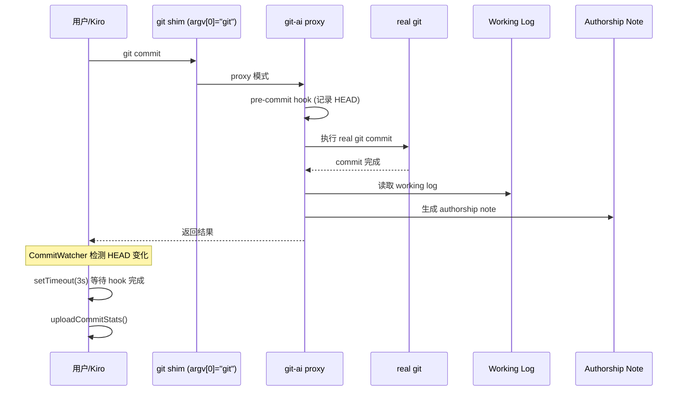
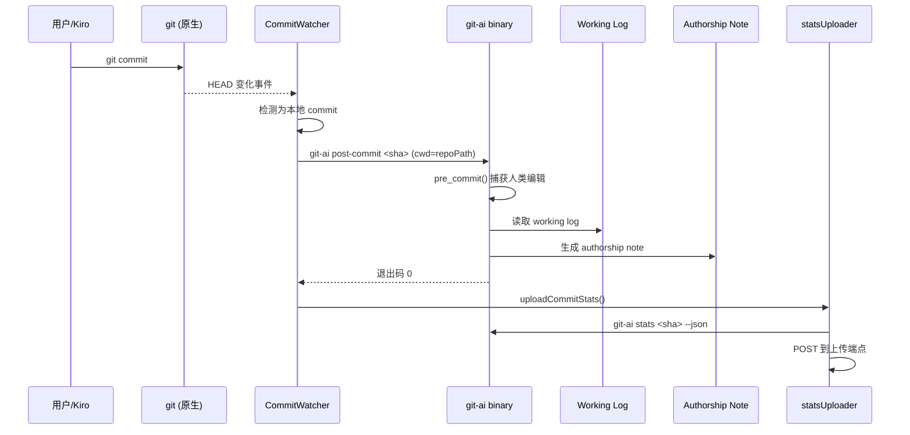

# 设计文档：移除 git.path 覆盖

## 概述

本设计将 `git-ai-kiro` 插件从"git 代理模式"（通过 `git.path` 指向 shim）迁移到"直接调用模式"（通过 CommitWatcher 检测 commit 后主动调用 `git-ai` 二进制执行 post-commit）。

核心变更：
1. **Rust 端**：新增 `git-ai post-commit` 顶层子命令，接受 commit SHA 作为位置参数，通过 cwd 定位仓库，直接执行 post-commit 逻辑
2. **TypeScript 端**：CommitWatcher 在检测到 commit 后先调用 `git-ai post-commit`，再触发 stats 上传
3. **TypeScript 端**：移除 shim 创建逻辑和 `git.path` 设置，添加残留配置清理

### 设计决策

**为什么选择 `git-ai post-commit` 作为顶层子命令？**

该命令由插件自动执行，用户不需要了解，不会增加认知负担。作为顶层子命令，Rust 端只需在 `handle_git_ai` 的 match 中新增一个分支，改动量最小，无需修改 `handle_git_hooks` 的结构。

**为什么 CommitWatcher 需要获取 base_commit（父 commit）？**

`post_commit()` 函数需要 `base_commit: Option<String>` 参数来定位 working log 目录（`.git/ai/working_logs/<base_commit>/`）。在 git proxy 模式下，这个值在 pre-commit hook 中通过 `repository.require_pre_command_head()` 捕获。在直接调用模式下，我们可以通过 `git rev-parse <commit>^` 获取父 commit SHA，初始 commit 时返回 None。

**为什么保留 statsUploader 的 retry 逻辑？**

虽然 post-commit 现在在 stats 上传前同步执行，但 authorship note 的写入可能因文件系统延迟等原因未立即可见。保留 retry 作为防御性措施。

## 架构

### 当前架构（git 代理模式）



### 新架构（直接调用模式）



## 组件与接口

### 1. Rust 端：`git-ai post-commit` 顶层子命令

**修改文件**: `src/commands/git_ai_handlers.rs`

在 `handle_git_ai` 的 match 中新增 `"post-commit"` 分支，改动量最小。

**命令格式**:
```
git-ai post-commit <commit_sha>
```

在仓库工作目录下执行（通过 cwd 定位仓库），与 `git-ai stats <sha>` 等命令风格一致。

**参数**:
- `<commit_sha>`: 新 commit 的完整 SHA（位置参数）

**行为**:
1. 通过 `find_repository()` 从 cwd 发现仓库
2. 通过 `git rev-parse <commit>^` 获取父 commit SHA（初始 commit 时为 None）
3. 通过 `repo.git_commit_author_identity()` 获取 commit 作者信息
4. 先调用 `pre_commit::pre_commit(&repo, author)` 捕获 AI session 结束后的人类编辑（写入 human checkpoint 到 working log）
5. 调用 `repo.handle_rewrite_log_event(RewriteLogEvent::commit(base_commit, commit_sha), author, true, true)`
6. 成功时退出码 0，失败时退出码 1 并输出错误到 stderr

> **注意**：步骤 4 是必要的。移除 git.path 代理后，原生 git commit 不再经过 git-ai 的 pre-commit hook，因此需要在 post-commit 子命令内部补上 pre_commit 调用，以捕获 AI checkpoint 之后、commit 之前的人类编辑。commit 后工作目录内容与已提交内容一致，因此时机上不影响正确性。

**接口定义**:
```rust
// 在 handle_git_ai 的 match 中新增分支
"post-commit" => {
    handle_post_commit(&args[1..]);
}

fn handle_post_commit(args: &[String]) {
    // args[0] = commit_sha
    // 通过 find_repository() 从 cwd 发现仓库
    // 获取父 commit，获取作者
    // 先调用 pre_commit::pre_commit() 捕获人类编辑
    // 再调用 handle_rewrite_log_event
}
```

### 2. TypeScript 端：CommitWatcher 修改

**修改文件**: `agent-support/kiro/src/commitWatcher.ts`

**变更**:
- 移除 `POST_COMMIT_DELAY_MS` 常量和 `setTimeout` 延迟
- 在检测到本地 commit 后，先调用 `git-ai post-commit`（await 完成）
- post-commit 完成后（无论成功失败）再调用 `uploadCommitStats`

**新增函数接口**:
```typescript
/**
 * 调用 git-ai 二进制执行 post-commit 处理。
 * @returns true 如果成功，false 如果失败
 */
async function runPostCommit(
  repoPath: string,
  commitSha: string
): Promise<boolean>
```

### 3. TypeScript 端：checkpoint.ts 修改

**修改文件**: `agent-support/kiro/src/checkpoint.ts`

**变更**:
- 移除 `gitShimPath` 变量和 `getGitShimPath()` 导出
- 移除 `initBundledBinary` 中创建 git shim（symlink/copy）的代码块
- 保留 `bundledBinaryPath`、`binaryReady`、quarantine 移除、chmod 逻辑

### 4. TypeScript 端：extension.ts 修改

**修改文件**: `agent-support/kiro/src/extension.ts`

**变更**:
- 移除 `getGitShimPath` 导入
- 移除设置 `git.path` 的代码块
- 新增：激活时检查 `git.path` 是否指向插件 `bin/` 目录，如果是则重置为 undefined
- 新增函数：

```typescript
/**
 * 清理之前版本残留的 git.path 配置。
 * 仅当 git.path 指向本插件的 bin/ 目录时才重置。
 */
function cleanupGitPathOverride(extensionPath: string): void
```

## 数据模型

### 命令行参数模型

`git-ai post-commit` 子命令的参数：

| 参数 | 类型 | 必需 | 说明 |
|------|------|------|------|
| `<commit_sha>` | String (位置参数) | 是 | commit 的完整 SHA-1 |
| cwd | - | 是 | 通过进程工作目录定位仓库（非命令行参数） |

### 进程间通信

CommitWatcher 通过 `child_process.spawn` 调用 git-ai 二进制：

```
argv[0] = <bundledBinaryPath>  (e.g., /path/to/extension/bin/git-ai)
argv[1] = "post-commit"
argv[2] = <commitSha>
cwd     = <repoPath>
```

退出码语义：
- `0`: post-commit 处理成功
- `1`: 处理失败（错误信息输出到 stderr）

### 数据流变更

**之前**：`git proxy pre-commit` → 记录 HEAD → `git commit` → `git proxy post-commit` → 读取 working log → 写入 authorship note

**之后**：`git commit`（原生）→ CommitWatcher 检测 HEAD 变化 → `git-ai post-commit <sha>`（cwd=repoPath）→ pre_commit() 捕获人类编辑 → 通过 `git rev-parse <sha>^` 获取父 commit → 读取 working log → 写入 authorship note


## 正确性属性

*属性是在系统所有有效执行中都应成立的特征或行为——本质上是关于系统应该做什么的形式化陈述。属性是人类可读规范与机器可验证正确性保证之间的桥梁。*

### 属性 1：Post-commit 命令参数正确性

*对于任意*有效的仓库路径和 commit SHA，当 CommitWatcher 调用 git-ai 二进制时，生成的命令参数应包含 `post-commit <commitSha>`，cwd 应设为 repoPath，且 SHA 与检测到的值完全一致。

**验证: 需求 2.2**

### 属性 2：Post-commit 先于 stats 上传且容错

*对于任意* commit 事件，CommitWatcher 应先 await post-commit 处理完成，然后再触发 stats 上传；且无论 post-commit 的退出码是 0（成功）还是非 0（失败），stats 上传都应被执行。

**验证: 需求 2.4, 2.5, 4.1**

### 属性 3：直接调用与代理模式等价

*对于任意*包含 working log 数据的 commit，通过 `git-ai post-commit <sha>`（cwd=repoPath）直接调用产生的 authorship note 应与通过 git proxy 模式的 post-commit hook 产生的 authorship note 完全一致。

**验证: 需求 3.4**

### 属性 4：git.path 清理正确性

*对于任意* `git.path` 配置值和插件路径，当且仅当 `git.path` 指向插件 `bin/` 目录内的路径时，插件应将其重置为 undefined；若 `git.path` 指向其他位置，则不应修改。

**验证: 需求 6.2, 6.4**

## 错误处理

### Rust 端

| 场景 | 处理方式 |
|------|----------|
| `<commit_sha>` 位置参数缺失 | 输出用法提示到 stderr，退出码 1 |
| `pre_commit::pre_commit()` 失败 | 记录警告日志，继续执行 post_commit 逻辑（非致命错误） |
| `find_repository()` 失败（cwd 不在 git 仓库内） | 输出错误到 stderr，退出码 1 |
| `git rev-parse <commit>^` 失败（初始 commit） | 将 `base_commit` 设为 `None`，继续执行 |
| `handle_rewrite_log_event` 内部错误 | 错误已在函数内部通过 `debug_log` 和 `log_error` 处理，不会 panic |
| Working log 不存在（纯人工 commit） | `post_commit` 正常处理，生成全人工归属的 authorship note |

### TypeScript 端

| 场景 | 处理方式 |
|------|----------|
| git-ai 二进制不存在 | `getGitAiBinary()` 返回 null，跳过 post-commit，仍执行 stats 上传 |
| `runPostCommit` spawn 失败 | 捕获错误，记录日志，返回 false，继续 stats 上传 |
| `runPostCommit` 退出码非 0 | 记录 stderr 内容，返回 false，继续 stats 上传 |
| `runPostCommit` 超时 | 设置合理超时（如 30 秒），超时后 kill 进程，返回 false |
| `cleanupGitPathOverride` 重置失败 | 捕获异常，记录日志，不影响插件其他功能 |

## 测试策略

### 单元测试

**TypeScript 端**:
- `cleanupGitPathOverride`: 测试 git.path 指向 bin/ 时重置，指向其他路径时不修改
- `runPostCommit`: 测试参数构建正确性，成功/失败返回值
- `CommitWatcher`: 测试 post-commit 在 stats 上传前执行，post-commit 失败不阻塞上传
- `initBundledBinary`: 测试不再创建 shim

**Rust 端**:
- `handle_post_commit_hook`: 测试位置参数解析（缺失 commit SHA、无效 SHA）
- 集成测试：创建 TestRepo，写入 working log，在 repo 目录下调用 `git-ai post-commit <sha>`，验证 authorship note 生成

### 属性测试

属性测试适用于本功能中的核心逻辑验证，特别是属性 3（直接调用与代理模式等价）和属性 4（git.path 清理正确性）。

**测试库**: Rust 端使用项目现有的集成测试框架（TestRepo），TypeScript 端使用 `fast-check`。

**配置**: 每个属性测试最少运行 100 次迭代。

**标签格式**: `Feature: remove-git-path-override, Property {number}: {property_text}`

- **属性 1 测试**: 生成随机仓库路径和 commit SHA，验证 `runPostCommit` 构建的命令参数正确
- **属性 2 测试**: 模拟 post-commit 的不同退出码（0, 1, 信号终止），验证 stats 上传始终被调用且在 post-commit 之后
- **属性 3 测试**: 使用 Rust 集成测试框架，创建包含随机 AI 编辑的 commit，分别通过 proxy 模式和直接调用模式执行 post-commit，比较生成的 authorship note
- **属性 4 测试**: 生成随机的 extensionPath 和 git.path 值，验证清理逻辑的正确性

### 集成测试

- 端到端流程：AI 编辑 → checkpoint → git commit → CommitWatcher 检测 → post-commit → stats 上传
- 跨平台：验证 macOS、Linux、Windows 上的二进制调用和路径处理
- 升级场景：模拟从旧版本（有 git.path 残留）升级到新版本，验证清理逻辑
