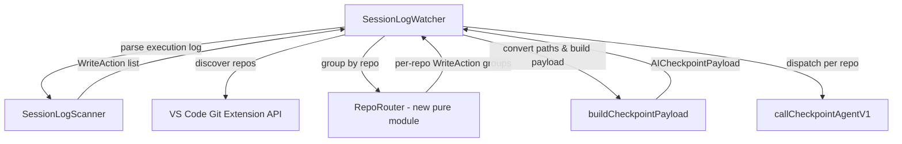
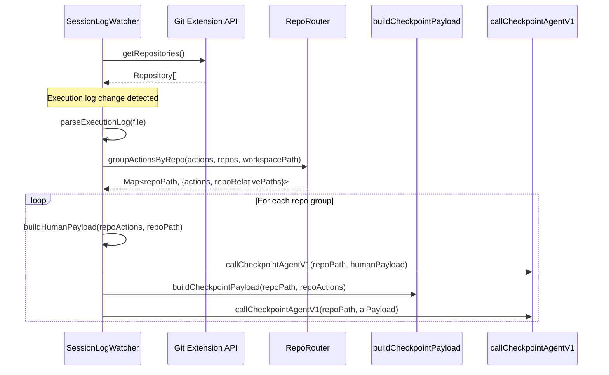
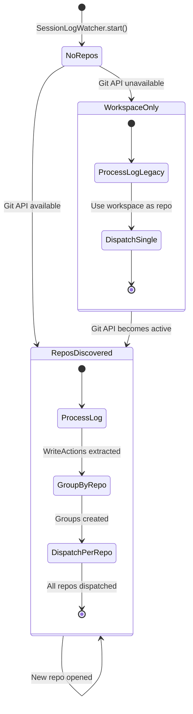

# Design Document: Repo-Aware Checkpoint Routing

## Overview

This feature modifies the Kiro VS Code extension's `SessionLogWatcher` to correctly handle multi-repo workspaces. Currently, the watcher sends all checkpoint payloads with workspace-relative paths and `cwd` set to the workspace root. In multi-repo workspaces (a parent directory containing multiple git repos), this causes a path key mismatch: `edited_filepaths` get converted to repo-relative by git-ai's internal multi-repo detection, but `dirty_files` keys remain workspace-relative, leading to incorrect attribution.

The solution makes the extension repo-aware by:
1. Discovering git repositories via VS Code's built-in git extension API (same pattern used by `CommitWatcher`)
2. Grouping `WriteAction` records by repository using longest-prefix matching on absolute paths
3. Converting workspace-relative paths to repo-relative paths
4. Dispatching per-repo checkpoints with `cwd` set to the repository directory

This bypasses git-ai's multi-repo detection entirely, ensuring consistent paths across all payload fields.

### Design Rationale

The key design decision is to perform repo discovery and path routing at the extension level rather than relying on git-ai's internal multi-repo handling. This is because:
- The extension already has access to VS Code's git extension API (proven pattern in `CommitWatcher`)
- Routing at the source eliminates the path mismatch entirely rather than trying to fix it downstream
- Per-repo dispatch with correct `cwd` means git-ai receives payloads that look identical to single-repo workspaces

## Architecture

### Component Interaction



### Data Flow



### Module Boundaries

The design introduces one new pure-function module and modifies two existing modules:

| Module | Role | Pure? |
|--------|------|-------|
| `repoRouter.ts` (new) | Repo discovery, action grouping, path conversion | Yes (core logic) |
| `sessionLogWatcher.ts` (modified) | Orchestration, lifecycle, git API integration | No (I/O, VS Code API) |
| `checkpointPayload.ts` (modified) | Payload building with repo path | Mostly (fs read for Format B) |

The pure `repoRouter.ts` module contains all testable logic: path prefix matching, longest-prefix selection, workspace-to-repo path conversion, and action grouping. This separation enables thorough property-based testing without mocking VS Code APIs.

## Components and Interfaces

### New Module: `repoRouter.ts`

```typescript
/**
 * RepoRouter — pure-function module for routing WriteActions to git repositories.
 *
 * All functions are pure (no I/O, no VS Code API dependencies) and never throw.
 * Path operations use forward-slash normalization for cross-platform consistency.
 */

/** A discovered git repository with its absolute root path. */
export interface RepoInfo {
  /** Absolute path to the repository root (forward-slash normalized). */
  rootPath: string;
}

/** Result of grouping WriteActions by repository. */
export interface RepoActionGroup {
  /** Absolute path to the repository root. */
  repoPath: string;
  /** WriteActions with filePath converted to repo-relative. */
  actions: WriteAction[];
}

/**
 * Normalize a file path to use forward slashes consistently.
 * Handles Windows backslashes and mixed separators.
 */
export function normalizePath(p: string): string;

/**
 * Ensure a path ends with a trailing forward slash for prefix matching.
 * If the path already ends with '/', returns it unchanged.
 */
export function ensureTrailingSlash(p: string): string;

/**
 * Find the repository whose root is the longest prefix of the given absolute file path.
 * Returns null if no repository matches.
 *
 * @param absoluteFilePath - Absolute path to the file (forward-slash normalized)
 * @param repos - List of discovered repositories
 * @returns The matching RepoInfo, or null if no match
 */
export function findRepoForFile(
  absoluteFilePath: string,
  repos: RepoInfo[]
): RepoInfo | null;

/**
 * Convert a workspace-relative file path to a repo-relative file path.
 *
 * @param workspaceRelativePath - File path relative to workspace root
 * @param workspacePath - Absolute path to workspace root
 * @param repoPath - Absolute path to repository root
 * @returns File path relative to repository root (forward-slash, no leading separator)
 */
export function toRepoRelativePath(
  workspaceRelativePath: string,
  workspacePath: string,
  repoPath: string
): string;

/**
 * Group WriteActions by their owning repository.
 *
 * For each WriteAction:
 * 1. Resolve workspace-relative filePath to absolute path
 * 2. Find the repo with the longest matching prefix
 * 3. Convert filePath to repo-relative
 * 4. Add to the repo's group
 *
 * Actions that don't match any repo are logged and skipped (orphans).
 *
 * @param actions - WriteActions with workspace-relative filePaths
 * @param repos - Discovered repositories
 * @param workspacePath - Absolute workspace root path
 * @returns Array of RepoActionGroup, one per repo that has matching actions
 */
export function groupActionsByRepo(
  actions: WriteAction[],
  repos: RepoInfo[],
  workspacePath: string
): { groups: RepoActionGroup[]; orphans: WriteAction[] };
```

### Modified: `SessionLogWatcher`

Key changes to the `SessionLogWatcher` class:

```typescript
class SessionLogWatcher {
  // New fields
  private repos: RepoInfo[] = [];
  private gitApiDisposable: vscode.Disposable | null = null;

  /**
   * Initialize repository tracking from VS Code git extension.
   * Falls back to workspace root if git extension is unavailable.
   */
  private initRepoDiscovery(): void;

  /**
   * Handle a new repository being opened by the git extension.
   */
  private onRepoDiscovered(repo: GitRepository): void;

  // Modified: processExecutionLog now groups by repo and dispatches per-repo
  private async processExecutionLog(filePath: string): Promise<void>;
}
```

### Modified: `buildCheckpointPayload`

The function signature is unchanged — the `workspacePath` parameter is now semantically a "base path" that can be either a workspace path or a repo path. The caller (`SessionLogWatcher`) passes the repo path when in multi-repo mode. No code changes needed in the function body since it already uses the first parameter for both `repo_working_dir` and file resolution.

### Modified: `extension.ts`

No changes needed. The `SessionLogWatcher` constructor already receives `workspacePath`. The git extension API is accessed directly within `SessionLogWatcher.initRepoDiscovery()`, following the same pattern as `CommitWatcher.start()`.

## Data Models

### RepoInfo

```typescript
interface RepoInfo {
  /** Absolute path to the repository root, forward-slash normalized. */
  rootPath: string;
}
```

Minimal representation of a git repository. Only the root path is needed for routing. The `rootPath` is always forward-slash normalized for consistent prefix matching across platforms.

### RepoActionGroup

```typescript
interface RepoActionGroup {
  /** Absolute path to the repository root. */
  repoPath: string;
  /** WriteActions with filePath converted to repo-relative. */
  actions: WriteAction[];
}
```

Represents a group of WriteActions that belong to a single repository, with their `filePath` fields already converted to repo-relative paths.

### WriteAction (unchanged)

The existing `WriteAction` interface is not modified. The `filePath` field is workspace-relative when read from execution logs, and becomes repo-relative after processing by `groupActionsByRepo`.

### AICheckpointPayload (unchanged)

The existing `AICheckpointPayload` interface is not modified. The `repo_working_dir` field receives the repository path instead of the workspace path when in multi-repo mode.

### State Transitions



## Correctness Properties

*A property is a characteristic or behavior that should hold true across all valid executions of a system — essentially, a formal statement about what the system should do. Properties serve as the bridge between human-readable specifications and machine-verifiable correctness guarantees.*

### Property 1: Grouping assigns each action to the longest-prefix repository

*For any* set of repositories and *for any* list of WriteActions whose absolute paths fall under at least one repository, each action SHALL be assigned to the repository with the longest matching root path prefix.

**Validates: Requirements 2.1, 2.2, 2.4**

### Property 2: Orphan exclusion

*For any* set of repositories and *for any* WriteAction whose absolute path does not fall under any repository root, that action SHALL appear in the orphans list and SHALL NOT appear in any repository group.

**Validates: Requirements 2.3**

### Property 3: Partition completeness

*For any* set of repositories and *for any* list of WriteActions, every action SHALL appear either in exactly one repository group or in the orphans list, and the total count of grouped actions plus orphaned actions SHALL equal the original action count.

**Validates: Requirements 2.1, 2.3**

### Property 4: Path conversion round-trip

*For any* workspace root path, *for any* repository root path that is a prefix of or equal to the workspace root, and *for any* workspace-relative file path that falls under the repository, converting the path to repo-relative and then resolving it against the repository root SHALL produce the same absolute path as resolving the original workspace-relative path against the workspace root.

**Validates: Requirements 3.1, 7.4**

### Property 5: Single-repo identity

*For any* workspace root path that is also a repository root, and *for any* workspace-relative file path, converting to repo-relative SHALL produce a path identical to the original workspace-relative path.

**Validates: Requirements 3.4, 5.1, 5.3**

### Property 6: Output path format invariants

*For any* valid path conversion from workspace-relative to repo-relative, the resulting path SHALL contain only forward slashes (no backslashes) and SHALL NOT start with a path separator character.

**Validates: Requirements 7.1, 7.2**

## Error Handling

### Git Extension API Unavailable

When the VS Code git extension is not found or not active:
- Log a warning with `[git-ai-kiro]` prefix
- Fall back to treating `workspacePath` as the sole repository root
- Continue normal operation — all actions will be grouped under the workspace root
- This preserves backward compatibility with the current single-repo behavior

### Deferred Git Extension Initialization

When the git extension exists but is not yet active at startup:
- Use workspace root as initial repo, log deferred initialization message
- Subscribe to `onDidOpenRepository` to pick up repos as they become available
- Any execution logs processed before repos are discovered use workspace-root fallback

### Orphan Files

When a WriteAction's file path doesn't match any discovered repository:
- Log a warning with `[git-ai-kiro]` prefix including the orphan file path
- Skip the action (do not include in any checkpoint payload)
- Continue processing remaining actions

### Per-Repository Checkpoint Failure

When `callCheckpointAgentV1` fails for a specific repository:
- Log the error with `[git-ai-kiro]` prefix
- Continue processing remaining repository groups
- Update StatusBar to failure state only after all repos are attempted

### Path Conversion Edge Cases

- Mixed path separators (Windows): normalize to forward slashes before comparison
- Trailing slashes on repo roots: ensure consistent handling via `ensureTrailingSlash`
- Empty or invalid paths: skip with warning log

## Testing Strategy

### Property-Based Testing

This feature is well-suited for property-based testing because the core logic consists of pure functions (path conversion, grouping, prefix matching) with clear input/output behavior and a large input space (arbitrary file paths, repo configurations).

**Library**: `fast-check` (already a devDependency in the project)

**Configuration**: Minimum 100 iterations per property test.

**Tag format**: `Feature: repo-aware-checkpoint-routing, Property {number}: {property_text}`

Each correctness property (1–6) will be implemented as a single property-based test in a new test file `agent-support/kiro/src/__tests__/repoRouter.property.test.ts`.

**Generators needed**:
- `repoInfoArb`: Generate `RepoInfo` with valid absolute paths
- `nestedRepoSetArb`: Generate sets of repos including nested configurations
- `writeActionUnderRepoArb`: Generate WriteActions with paths guaranteed to fall under a specific repo
- `orphanWriteActionArb`: Generate WriteActions with paths outside all repos
- `workspacePathArb`: Generate valid absolute workspace paths
- `mixedSeparatorPathArb`: Generate paths with mixed forward/back slashes (Windows edge cases)

### Unit Testing

Unit tests will cover integration concerns that are not suitable for property-based testing:

**File**: `agent-support/kiro/src/__tests__/repoRouter.unit.test.ts`
- Git extension API discovery (mocked)
- `onDidOpenRepository` event handling
- Deferred initialization flow
- Per-repo checkpoint dispatch ordering (human → AI per repo)
- Error handling when checkpoint calls fail
- Logging output verification

**File**: `agent-support/kiro/src/__tests__/sessionLogWatcher.unit.test.ts` (existing, extend)
- Multi-repo dispatch integration
- Single-repo backward compatibility (end-to-end with mocked dependencies)

### Test Coverage Matrix

| Requirement | Property Test | Unit Test |
|-------------|--------------|-----------|
| 1.1 Git API query on start | — | ✓ |
| 1.2 New repo event handling | — | ✓ |
| 1.3 Fallback to workspace root | — | ✓ |
| 1.4 Warning log on no repos | — | ✓ |
| 2.1 Group by prefix | Property 1 | — |
| 2.2 Longest prefix wins | Property 1 | — |
| 2.3 Orphan handling | Property 2 | — |
| 2.4 Separate groups | Property 1 | — |
| 3.1 Path conversion | Property 4 | — |
| 3.2 Consistent path usage | — | ✓ |
| 3.3 repo_working_dir set | — | ✓ |
| 3.4 Single-repo identity | Property 5 | — |
| 4.1 cwd = repo path | — | ✓ |
| 4.2 Separate calls per repo | — | ✓ |
| 4.3 Human/AI ordering | — | ✓ |
| 4.4 Continue on failure | — | ✓ |
| 5.1 Backward compat payload | Property 5 | ✓ |
| 5.2 Single call in single-repo | — | ✓ |
| 5.3 No path transformation | Property 5 | — |
| 6.1 Deferred init fallback | — | ✓ |
| 6.2 Update on API active | — | ✓ |
| 6.3 Continue during deferred | — | ✓ |
| 7.1 Forward-slash normalization | Property 6 | — |
| 7.2 No leading separator | Property 6 | — |
| 7.3 Mixed separators | Property 4, 6 | — |
| 7.4 Round-trip | Property 4 | — |
| 8.1 Format B path resolution | — | ✓ |
| 8.2 repo_working_dir | — | Existing |
| 8.3 Backward compat | — | Existing |

