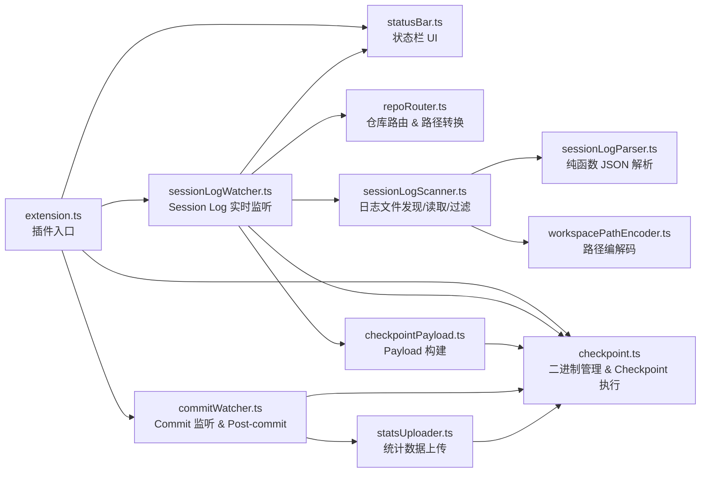
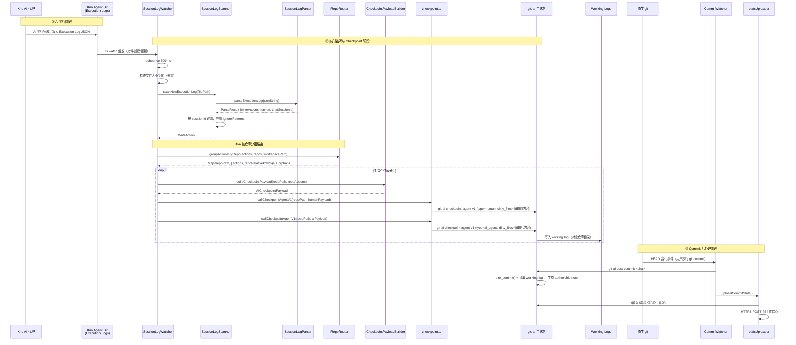

# git-ai for Kiro

一个 VS Code 扩展，用于在 [Kiro IDE](https://kiro.dev) 中自动追踪 AI 生成的代码，为每次 AI 编辑提供字符级别的归属标注。

当 Kiro 的 AI 代理编辑你的文件时，此扩展会捕获这些更改并将其传入 [git-ai](https://github.com/git-ai-project/git-ai)，使每次 `git commit` 都携带精确的元数据，标明哪些行由人类编写，哪些由 AI 生成。

## 安装

扩展内置了 `git-ai` 二进制文件，无需单独安装。

### 从源码构建

```bash
cd agent-support/kiro
npm install

# 构建特定平台的 .vsix 包：
npm run package:darwin-arm64   # macOS Apple Silicon
npm run package:win32-x64      # Windows x64

# 或同时构建两者：
npm run package:all
```

构建完成后会生成类似 `git-ai-kiro-darwin-arm64-0.1.0.vsix` 的文件。

### 在 Kiro 中安装

1. 打开 Kiro
2. 打开命令面板（`Cmd+Shift+P` / `Ctrl+Shift+P`）
3. 运行 **Extensions: Install from VSIX...**
4. 选择与你平台匹配的 `.vsix` 文件

## 使用方法

安装后，扩展会**自动运行**，无需任何配置：

1. 在 Kiro 中打开一个 git 仓库。
2. 像往常一样使用 Kiro 的 AI 代理编辑代码。
3. 扩展会在后台检测 AI 编辑并记录归属数据。
4. 当你执行 `git commit` 时，扩展自动调用 git-ai 完成 authorship note 的生成，将作者归属元数据作为 Git Note 附加到提交中。

> **多仓库工作区支持**：扩展现已支持多仓库工作区（即一个父目录下包含多个独立 git 仓库的场景）。扩展会通过 VS Code 内置 git 扩展 API 自动发现工作区内的所有 git 仓库，将 AI 写操作按仓库分组，并为每个仓库独立发送 checkpoint，确保文件路径和归属数据始终正确。单仓库工作区的行为与之前完全一致，无需额外配置。

### 查看归属信息

提交后，可以使用扩展内置的 git-ai 二进制查看 AI 归属信息。二进制位于扩展安装目录下的 `bin/` 中：

```bash
# macOS 下扩展内置二进制的典型路径：
# ~/.vscode/extensions/git-ai.git-ai-kiro-<version>/bin/git-ai
# 或 Kiro IDE：
# ~/.kiro/extensions/git-ai.git-ai-kiro-<version>/bin/git-ai

# 建议创建别名方便使用：
alias git-ai="$HOME/.kiro/extensions/git-ai.git-ai-kiro-0.1.0/bin/git-ai"

# 显示文件的 AI 与人类行归属
git-ai blame src/index.ts

# 显示 AI 贡献统计
git-ai stats

# 显示 AI 归属的 diff
git-ai diff HEAD~1
```

### 统计数据上传

扩展支持在每次 `git commit` 后，自动将该 commit 的归属统计数据上传到远程控制面板服务。此功能默认关闭，需配置上传地址和鉴权 token 后才会启用。

采用增量上报模式：每次 commit 上报该 commit 的数据（包括人工和 AI 的代码行数），服务端负责按用户和仓库维度汇总。这样在多人协作的仓库中，每个开发者独立上报自己的增量，不会互相覆盖。

触发时机：
- 每次 `git commit` 完成后（通过监听 HEAD 变化自动触发）

上传的数据包括：
- 仓库基本信息（名称、远程地址、分支、commit SHA）
- 开发者信息（user_name、user_email、machine_id）
- 该 commit 的归属统计（人工行数、AI 生成行数、接受行数、等待时间等，由 `git-ai stats` 提供）
- 按工具和模型维度的细分数据

注意事项：
- `statsUploadUrl` 或 `statsUploadToken` 为空时功能完全关闭，不发送任何请求
- 上传失败只记录到 Output Channel 日志，不弹窗打扰用户
- HTTP 请求超时 10 秒，异步执行，不阻塞 commit 流程
- 网络失败时自动重试，最多 3 次，间隔 2s / 4s / 8s（指数退避）
- 仅对网络错误和 HTTP 5xx 重试，4xx 错误不重试

详细的接口定义和字段说明请参阅 [Stats Upload API 文档](docs/stats-upload-api.md)。

### 配置

| 设置项 | 默认值 | 描述 |
|--------|--------|------|
| `gitai.kiro.enableCheckpointLogging` | `false` | 每次创建检查点时显示通知。 |
| `gitai.kiro.statsUploadUrl` | `""` | 统计数据上传地址（完整 URL），为空则不上传。 |
| `gitai.kiro.statsUploadToken` | `""` | Bearer token，用于上传鉴权。 |
| `gitai.kiro.ignorePatterns` | `[...]` | 文件和目录排除模式列表，匹配的文件不参与 AI 归属追踪和统计上传。 |

## 工作原理

### 模块依赖关系



- **extension.ts**：插件入口，负责初始化二进制、清理残留 `git.path` 配置、创建各模块实例并注册到 VS Code 生命周期。
- **sessionLogWatcher.ts**：核心模块，通过 `fs.watch` 实时监听 Kiro Agent Dir 下的 Execution Log 目录变化，检测到新的或更新的执行日志时，解析 AI 写操作并调用 `callCheckpointAgentV1` 将数据写入 git-ai working logs。替代了原有的 `AIEditManager`（Output Channel 监听方案）。
- **repoRouter.ts**：纯函数模块，负责 git 仓库路由。通过最长前缀匹配将 WriteAction 分配到对应的 git 仓库，将工作区相对路径转换为仓库相对路径，并按仓库分组输出。所有函数无 I/O 依赖，便于属性测试。
- **sessionLogScanner.ts**：协调器模块，负责跨平台 Agent Dir 路径解析、Execution Log 文件发现与读取、按 session ID 和时间窗口过滤。
- **sessionLogParser.ts**：纯函数模块，解析单个 Execution Log JSON，自动检测 Format A（`actions` 数组）和 Format B（`context.messages`）两种格式，提取统一的 WriteAction 列表。
- **workspacePathEncoder.ts**：纯函数模块，工作区绝对路径与 URL-safe Base64 编码之间的转换，用于定位 `workspace-sessions` 目录。
- **checkpointPayload.ts**：工具模块，将 WriteAction 列表转换为 `callCheckpointAgentV1` 所需的 AICheckpointPayload 格式。
- **checkpoint.ts**：管理内置 git-ai 二进制（quarantine 移除、chmod），提供 `callCheckpointAgentV1` 执行 checkpoint 命令，以及 ignore pattern 匹配。
- **commitWatcher.ts**：通过 VS Code git 扩展 API 监听 HEAD 变化，检测本地 commit 后调用 `git-ai post-commit` 生成 authorship note，再触发 stats 上传。
- **statsUploader.ts**：调用 `git-ai stats <sha> --json` 获取归属统计，通过 HTTPS POST 上传到控制面板，支持重试和幂等。
- **statusBar.ts**：在 VS Code 状态栏显示扩展工作状态（监听中 / 更新中 / 成功 / 失败 / 未激活）。

### 端到端流程



流程图分为三个阶段：

- **① AI 执行阶段**：Kiro AI 代理执行完成后，将 Execution Log 以 JSON 文件形式持久化到磁盘的 Kiro Agent Dir 中。
- **② 实时监听与 Checkpoint 阶段**：`SessionLogWatcher` 通过 `fs.watch` 实时监听 Execution Log 目录变化。检测到新文件或文件更新后，经过 300ms debounce，由 `SessionLogScanner` 读取文件并调用 `SessionLogParser` 解析。解析器自动检测 Format A/B 格式，提取 `actionState === "Accepted"` 的写操作。然后通过 `RepoRouter` 将 WriteAction 按所属 git 仓库分组，将路径从工作区相对转换为仓库相对。对每个仓库分组分别构建 checkpoint payload，先发送 human checkpoint（使用 `originalContent` 作为 pre-edit 基线），再发送 AI checkpoint（使用 `modifiedContent` 作为编辑后内容），`cwd` 设为对应仓库目录，将数据写入 git-ai working logs。
- **③ Commit 后处理阶段**：与之前相同，`CommitWatcher` 监听 HEAD 变化，检测到 commit 后调用 `git-ai post-commit` 读取 working logs 生成 authorship note，再触发 stats 上传。

### AI 编辑检测

扩展通过 `SessionLogWatcher` 实时监听 Kiro Agent Dir 下的 Execution Log 目录变化来检测 AI 编辑事件。Kiro IDE 在每次 AI 执行完成后，会将完整的执行日志以 JSON 文件形式持久化到磁盘。扩展使用 `fs.watch` 监听这些目录，当检测到新文件或文件更新时，立即解析并提取 AI 写操作。

**支持两种日志格式**：

**1. Format A（`actions` 数组）**：数据最完整，包含 `originalContent` 和 `modifiedContent`，通常由 Autopilot / Spec 工作流产生。仅提取 `actionState === "Accepted"` 且 `actionType` 在写操作类型集合中的 action（`replace`、`create`、`write`、`append`、`editCode`、`delete`、`smartRelocate`）。

**2. Format B（`context.messages`）**：作为 fallback，从 bot 消息中的工具调用（`fsWrite`、`strReplace`、`fsAppend`、`deleteFile`）提取文件路径和内容，通常由 Chat 工作流产生。通过 `id` 字段匹配 `toolUseResponse`，仅保留 `success === true` 的调用。

解析器自动检测格式：如果 JSON 包含非空 `actions` 数组则使用 Format A，否则 fallback 到 Format B。两种格式返回统一的 WriteAction 列表。

**去重与过滤机制**：
- 通过文件路径 + 大小去重，同一文件大小未变化时跳过
- 按 `chatSessionId` 过滤，仅处理当前工作区关联的日志
- 应用 `matchesIgnorePattern` 过滤忽略的文件路径

### Debounce 与去重

`SessionLogWatcher` 启动时会记录所有已存在的执行日志文件大小，但**不处理它们**——只关心启动后发生的变化。这避免了重放历史日志导致 working log 数据混乱。

对于启动后的文件变化，使用 300ms debounce 窗口合并快速连续的事件（Kiro 可能分多次写入同一文件）。通过对比文件大小来去重——新文件直接处理，已存在文件大小未变化时跳过，文件大小变化时重新解析（Kiro 可能追加内容到同一执行日志）。

### Commit 后处理

扩展通过 `CommitWatcher` 监听 VS Code 内置 git 扩展的 HEAD 变化事件来检测新的 commit。检测到本地 commit 后：

1. **Post-commit 处理**：调用 `git-ai post-commit <sha>`（cwd 设为仓库路径），执行 authorship note 的生成。该命令会先调用 pre_commit 捕获 AI checkpoint 之后的人类编辑，再读取 working log 生成 authorship note。
2. **Stats 上传**：post-commit 完成后（无论成功失败），触发统计数据上传。

这种"直接调用模式"替代了之前通过修改 `git.path` 指向 git-ai shim 的"代理模式"，避免了对用户 git 环境的侵入性修改。扩展激活时会自动清理之前版本可能残留的 `git.path` 配置。

### 内置二进制文件处理

扩展在 `bin/` 目录下附带了特定平台的 `git-ai` 二进制文件。激活时：

1. **macOS**：运行 `xattr -cr bin/git-ai` 移除 macOS 对下载文件施加的隔离属性，防止 Gatekeeper 阻止执行。
2. **Unix**：确保对二进制文件执行 `chmod +x`（npm 打包可能会去除执行权限）。
3. 如果二进制文件缺失，扩展会显示错误并停用。

### 关键设计决策

- **自包含**：无需外部安装 `git-ai`。二进制文件已内置，从扩展自身目录解析。
- **非侵入式**：扩展不修改用户的 `git.path` 配置，不创建 git shim，不向编辑器注入钩子。通过监听磁盘 Execution Log 和 VS Code git API 实现所有功能。
- **Session Log 实时监听**：通过 `fs.watch` 监听 Kiro Agent Dir 下的 Execution Log 目录变化，比之前的 Output Channel 监听方案更可靠——不依赖 Kiro Logs 面板是否可见（[VS Code #171334](https://github.com/microsoft/vscode/issues/171334)），直接读取 Kiro 已持久化到磁盘的数据。
- **纯函数解析 + 协调器模式**：将日志解析（纯函数，无 I/O）与文件系统操作（协调器）分离，便于属性测试和单元测试。
- **双格式兼容**：同时支持 Format A（`actions` 数组，数据完整）和 Format B（`context.messages`，作为 fallback），确保所有 Kiro 工作流类型的 AI 编辑都能被检测。
- **顺序 Checkpoint**：human checkpoint 先于 AI checkpoint 执行，避免竞态条件。
- **非阻塞**：git-ai 进程错误会记录到控制台，但不会阻塞 IDE 或弹出错误提示。
- **Ignore Pattern 支持**：支持配置文件和目录排除模式，匹配的文件不参与 AI 归属追踪。
- **仓库感知 Checkpoint 路由**：扩展通过 VS Code 内置 git 扩展 API 自动发现工作区内的所有 git 仓库，将 AI 写操作按仓库分组（最长前缀匹配），并为每个仓库独立发送 checkpoint，`cwd` 设为对应仓库目录。这从源头消除了多仓库工作区下的路径不匹配问题，无需依赖 git-ai 内部的多仓库检测。单仓库工作区的行为与之前完全一致，不会产生任何回归。

### 状态栏

状态栏显示扩展的当前工作状态：

| 状态 | 显示文本 | 说明 |
|------|----------|------|
| watching | `git-ai: 监听中` | 正常监听 AI 编辑事件 |
| checkpointing | `git-ai: 更新中` | 正在执行 checkpoint |
| success | `git-ai: 更新成功` | checkpoint 成功（2 秒后恢复为"监听中"） |
| failure | `git-ai: 更新失败` | checkpoint 失败（2 秒后恢复为"监听中"） |
| inactive | `git-ai: 未激活` | 二进制文件不可用 |

## 开发

```bash
npm install

# 编译 TypeScript
npm run compile

# 监听模式（文件变更时自动重新编译）
npm run watch

# 运行测试
npm run test
```

### 项目结构

```
agent-support/kiro/
├── bin/                    # 内置的 git-ai 平台二进制文件
├── docs/
│   └── stats-upload-api.md # Stats Upload API 接口文档
├── src/
│   ├── extension.ts        # 插件入口，激活/停用逻辑
│   ├── sessionLogWatcher.ts # Session Log 实时监听（fs.watch、debounce、checkpoint 触发）
│   ├── sessionLogScanner.ts # 日志文件发现、读取、过滤（协调器）
│   ├── sessionLogParser.ts  # Execution Log JSON 解析（纯函数，Format A/B 自动检测）
│   ├── workspacePathEncoder.ts # 工作区路径 URL-safe Base64 编解码
│   ├── repoRouter.ts        # 仓库路由：git 仓库发现、WriteAction 按仓库分组、路径转换（纯函数）
│   ├── checkpointPayload.ts # Checkpoint Payload 构建
│   ├── checkpoint.ts       # 内置二进制管理、checkpoint 命令执行、ignore pattern 匹配
│   ├── commitWatcher.ts    # Git commit 监听、post-commit 处理
│   ├── statsUploader.ts    # 统计数据上传（HTTP POST、重试、幂等）
│   ├── statusBar.ts        # 状态栏 UI
│   └── __tests__/          # 单元测试和属性测试
├── scripts/                # 构建辅助脚本
├── package.json
└── tsconfig.json
```

### 支持的平台

| 平台 | VS Code 目标 | 发布资源 |
|------|-------------|----------|
| macOS Apple Silicon | `darwin-arm64` | `git-ai-macos-arm64` |
| Windows x64 | `win32-x64` | `git-ai-windows-x64.exe` |

## 限制

- **Execution Log 格式依赖**：此扩展解析 Kiro IDE 持久化到磁盘的 Execution Log JSON 文件，该格式没有公开 API 保证。日志格式可能随 Kiro 版本更新而变化。
- **双格式 Fallback**：Format B（`context.messages`）不包含 `originalContent`，需要从磁盘读取当前文件内容作为 fallback，可能不如 Format A 精确。
- **fs.watch 平台差异**：`fs.watch` 在不同操作系统上的行为可能有差异（如事件类型、递归监听支持等），扩展通过 debounce 和去重机制缓解。
- **依赖 VS Code 内置 git 扩展 API**：多仓库工作区的仓库发现依赖 VS Code 内置 git 扩展（`vscode.git`）提供的 API。如果该扩展被禁用或尚未激活，扩展会回退到将工作区根目录作为唯一仓库处理，此时多仓库场景下的路径归属可能不正确。

## 已知问题

### ~~多仓库工作区下的路径归属错误~~（已修复）

此问题已通过仓库感知 checkpoint 路由功能修复。之前在多仓库工作区（父目录包含多个 git 仓库）中，`edited_filepaths` 会被 git-ai 内部转换为仓库相对路径，但 `dirty_files` 的键仍为工作区相对路径，导致路径不匹配，AI 编写的代码被错误归因为人类。现在扩展会在发送 checkpoint 前自动按仓库分组并转换路径，彻底避免了此问题。

### 同一文件多次编辑时的归因偏差

当 AI 对同一文件进行多次编辑时，少量行可能被错误归因为人类（human）。

**原因**：

这是 checkpoint 机制与 git-ai 归因算法交互产生的边界效应。

当 AI 对同一文件进行第 N 次编辑时，插件发送的 human checkpoint 包含该文件的 `originalContent`（第 N 次编辑前的内容）。这个 `originalContent` 中已经包含了前 N-1 次 AI 编辑的结果。git-ai 在做 diff 时，会将 human checkpoint 中已存在的行视为"human 的 pre-edit 基线"，导致这些行（通常是空行、闭合括号等在两次编辑之间未变化的行）被归因为 human。

**影响范围**：

- 仅影响**同一文件被 AI 多次编辑**的场景
- 受影响的行通常是空行、闭合括号等"边界行"
- 对统计数据的影响很小（通常 1-4 行）
- 不影响有实际代码内容的行的归因准确性

### Spec 流程中 subagent 写操作的归因缺失

在 Kiro 的 spec-driven 开发流程（Requirements → Design → Tasks → 实现）中，部分 AI 编辑可能被归因为人类。

**原因**：

Spec 流程使用 `invokeSubAgent` 内部机制来编排任务执行。subagent 在执行过程中通过标准工具（fsWrite、strReplace 等）写入文件，但这些写操作**不会被提升为父执行日志的顶层 Accepted action**。Kiro 只在 `actions` 数组中记录 `invokeSubAgent/Success`（subagent 调用成功），不记录 subagent 内部的具体文件写入操作。

由于插件只能从 `actions` 数组中提取 `actionState === "Accepted"` 的写操作，subagent 内部的写入对插件不可见，无法为这些文件创建 AI checkpoint。

**影响范围**：

- 仅影响 **spec 流程中的任务执行阶段**（`invokeSubAgent` 调用的 subagent）
- Spec 流程中的文档生成阶段（requirements.md、design.md、tasks.md）不受影响，因为这些文件的写入直接记录在顶层 `actions` 中
- 普通 chat 对话中的 AI 编辑不受影响
- 受影响的代码行会被归因为 human，导致 `human_additions` 偏高、`ai_additions` 偏低

## 许可证

与 [git-ai 项目](https://github.com/git-ai-project/git-ai/blob/main/LICENSE) 相同。
